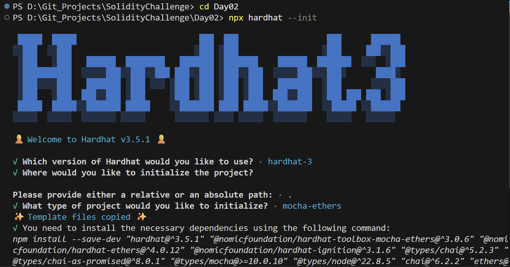
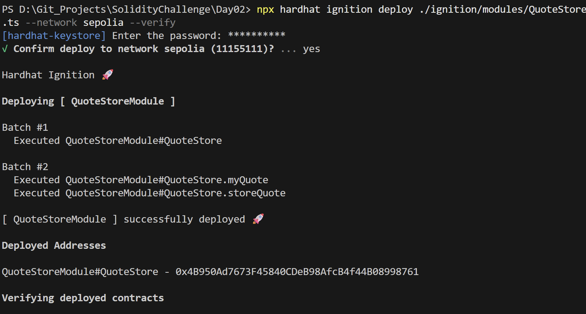
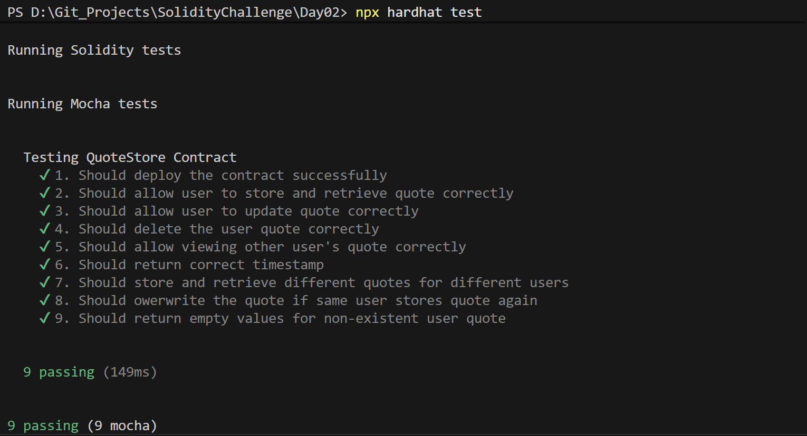

# Day 02 - Quote Store

## Overview
Quote Store is a Solidity smart contract project for storing and retrieving inspirational quotes on-chain. It demonstrates a small but practical storage workflow built with Hardhat and Ignition.

## Smart Contract Purpose
The contract allows a user to save a quote, update it, retrieve it later, and manage the stored quote with basic on-chain persistence.

## Features
- **Quote Storage**: Store a quote for the current user.
- **Quote Retrieval**: Retrieve the saved quote.
- **Quote Updates**: Update an existing quote.
- **Quote Deletion**: Delete stored quote data.
- **Minimalist Design**: Keep the contract interface minimal for testing and learning.

## Folder Structure & Contracts
The repository layout contains:

```
Day02/
├── contracts/
│   └── QuoteStore.sol    # Core smart contract code
├── test/
│   └── QuoteStore.ts            # Unit test suite
├── scripts/
│   └── send-op-tx.ts         # Script to execute operations
├── ignition/
│   └── modules/
│       └── QuoteStore.ts # Hardhat Ignition deployment module
└── screenshots/              # Execution screenshots (deployment, tests)
```

### Purpose of the Contract
- **QuoteStore**: Functions as a decentralized memo pad, allowing a user to persist a custom text quote on-chain, update it, and manage its state.

## Concepts Practiced
- On-chain string storage.
- CRUD contract design.
- Hardhat Ignition deployment flow.
- TypeScript-based Mocha and Chai testing.
- Sepolia testnet deployment and verification.

## Project Summary
- Language used: Solidity 0.8.28 and TypeScript.
- Tools used: Hardhat, Hardhat Ignition, ethers v6, Mocha, Chai, and forge-std.
- Contract name: QuoteStore.
- Testing: Hardhat test suite passed successfully.
- Deployment status: Deployed to Sepolia and verified on Blockscout.

## Deployment
- Network: Sepolia testnet.
- Deployed contract address: 0x4B950Ad7673F45840CDeB98AfcB4f44B08998761
- Verification: Successfully verified on Blockscout.

## Screenshots

**Intialization** : npx hardhat --init



**Deployemnt** : npx hardhat ignition deploy ./ignition/modules/SimpleAuction.ts --network sepolia --verify



**Testing Contracts** : npx hardhat test


