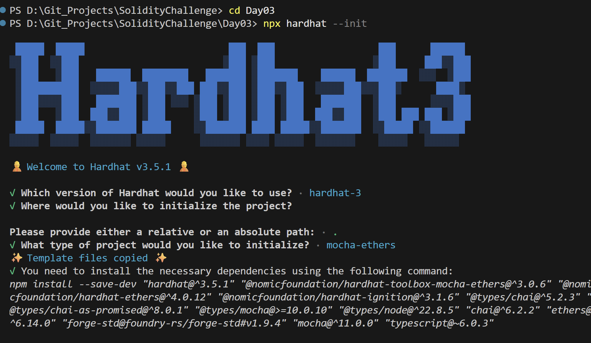
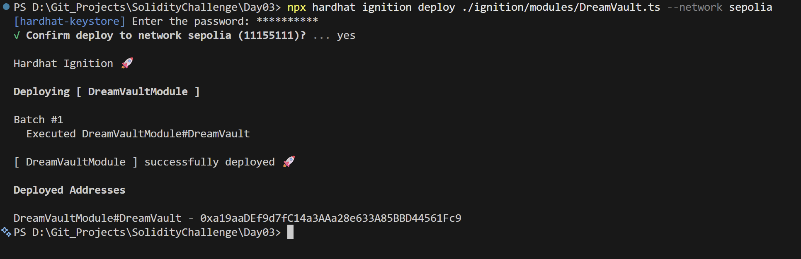
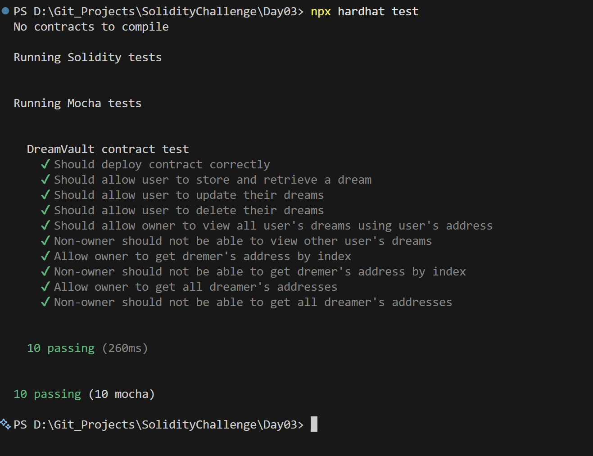

# Day 03 - Dream Vault

## Overview
Dream Vault is a Solidity smart contract for storing personal dreams and reading them back later. It is built as a lightweight data storage exercise with simple ownership-aware interactions.

## Smart Contract Purpose
The contract lets a user save dream entries, update them, retrieve them, and remove them as needed while keeping the storage model straightforward.

## Features
- **Dream Storage**: Store dream text on-chain.
- **Dream Retrieval**: Retrieve a stored dream.
- **Dream Updates**: Update an existing dream entry.
- **Dream Deletion**: Delete a dream entry.
- **User Isolation**: Support user-specific dream storage.

## Folder Structure & Contracts
The repository layout contains:

```
Day03/
├── contracts/
│   └── DreamVault.sol    # Core smart contract code
├── test/
│   └── DreamVault.ts            # Unit test suite
├── scripts/
│   └── send-op-tx.ts         # Script to execute operations
├── ignition/
│   └── modules/
│       └── DreamVault.ts # Hardhat Ignition deployment module
└── screenshots/              # Execution screenshots (deployment, tests)
```

### Purpose of the Contract
- **DreamVault**: Acts as a personal diary/dream journal ledger, isolating entries by user addresses so users can log, retrieve, update, and erase their personal dreams securely.

## Concepts Practiced
- String storage and retrieval in Solidity.
- Basic CRUD interactions.
- Hardhat Ignition deployment.
- Mocha and Chai test coverage.
- Sepolia deployment verification.

## Project Summary
- Language used: Solidity 0.8.28 and TypeScript.
- Tools used: Hardhat, Hardhat Ignition, ethers v6, Mocha, Chai, and forge-std.
- Contract name: DreamVault.
- Testing: Hardhat test suite passed successfully.
- Deployment status: Deployed to Sepolia and verified on Blockscout.

## Deployment
- Network: Sepolia testnet.
- Deployed contract address: 0xa19aaDEf9d7fC14a3AAa28e633A85BBD44561Fc9
- Verification: Successfully verified on Blockscout.

## Screenshots





