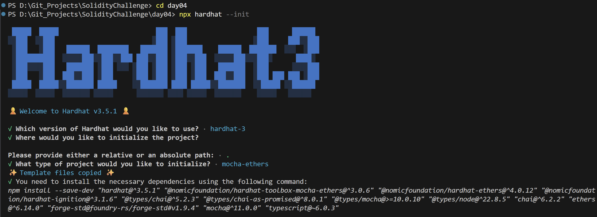
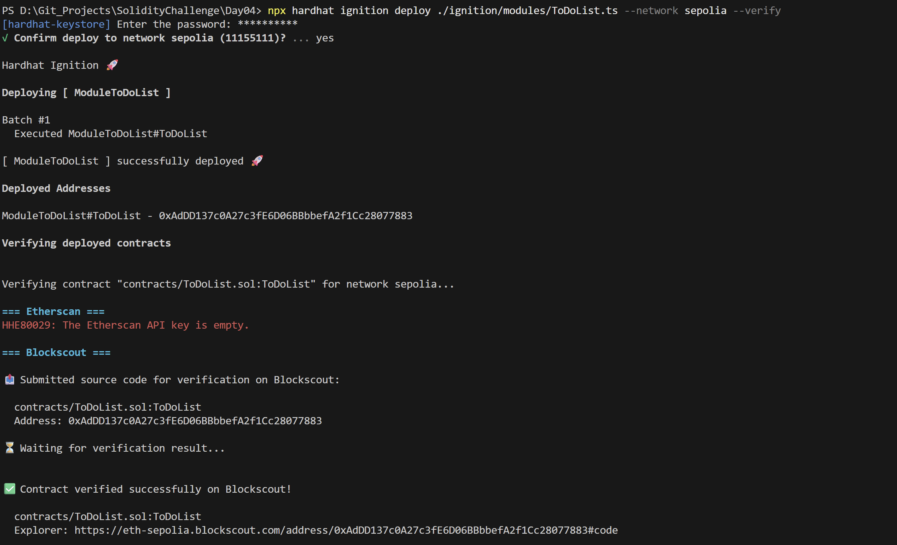
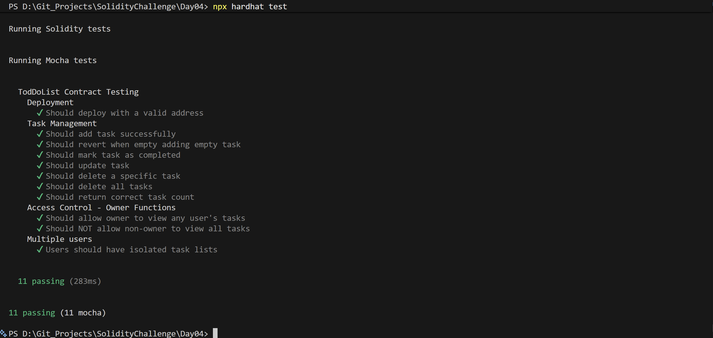

# Day 04 - To Do List

## Overview
To Do List is a Solidity smart contract for managing task entries on-chain. It provides a simple example of list-based state, mutation, and deletion operations.

## Smart Contract Purpose
The contract lets a user create tasks, mark them complete, update them, and remove them from storage while keeping the workflow easy to test.

## Features
- **Task Creation**: Add a new task.
- **Task Modification**: Update an existing task.
- **Completion Toggles**: Mark a task as completed.
- **Task Deletion**: Delete an individual task.
- **Bulk Reset**: Clear all tasks for a user.

## Folder Structure & Contracts
The repository layout contains:

```
Day04/
├── contracts/
│   └── ToDoList.sol    # Core smart contract code
├── test/
│   └── ToDoList.ts            # Unit test suite
├── scripts/
│   └── send-op-tx.ts         # Script to execute operations
├── ignition/
│   └── modules/
│       └── ToDoList.ts # Hardhat Ignition deployment module
└── screenshots/              # Execution screenshots (deployment, tests)
```

### Purpose of the Contract
- **ToDoList**: Implements a todo list tracker on-chain, storing an array of tasks per user with status flags (completed or not) and task manipulation controls.

## Concepts Practiced
- Dynamic array handling in Solidity.
- State mutation and task lifecycle management.
- Ignition deployment on Sepolia.
- Mocha and Chai test validation.
- User-specific task isolation.

## Project Summary
- **Language used**: Solidity 0.8.28 and TypeScript.
- **Tools used**: Hardhat, Hardhat Ignition, ethers v6, Mocha, Chai, and forge-std.
- **Contract name**: ToDoList.
- **Testing**: Hardhat test suite passed successfully.
- **Deployment status**: Deployed to Sepolia and verified on Blockscout.

## Deployment
- **Network**: Sepolia testnet.
- **Deployed contract address**: 0xAdDD137c0A27c3fE6D06BBbbefA2f1Cc28077883
- **Verification**: Successfully verified on Blockscout.

## Screenshots

**Intialization** : npx hardhat --init



**Deployemnt** : npx hardhat ignition deploy ./ignition/modules/ToDoList.ts --network sepolia --verify



**Testing Contracts** : npx hardhat test


