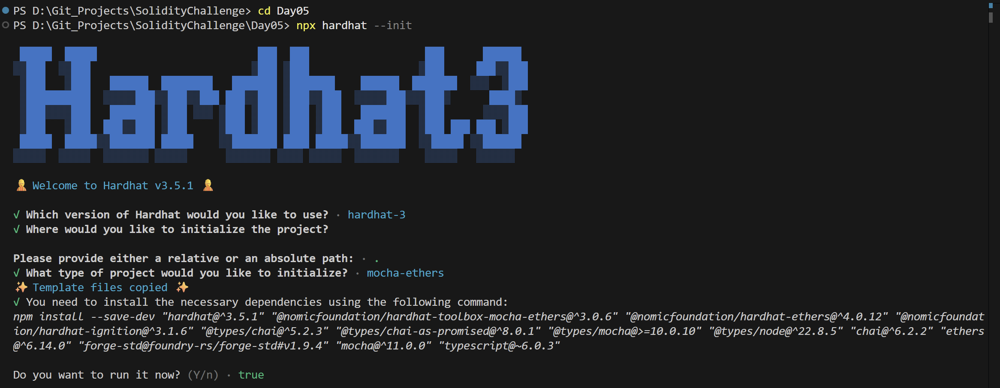
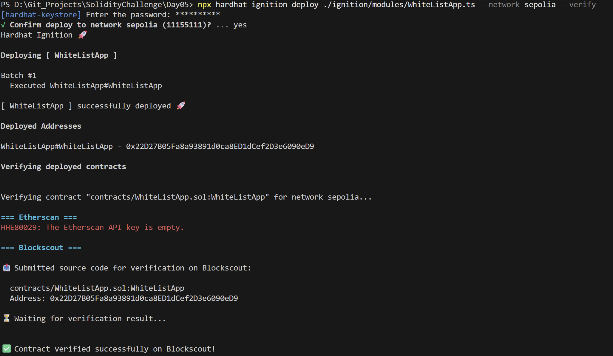
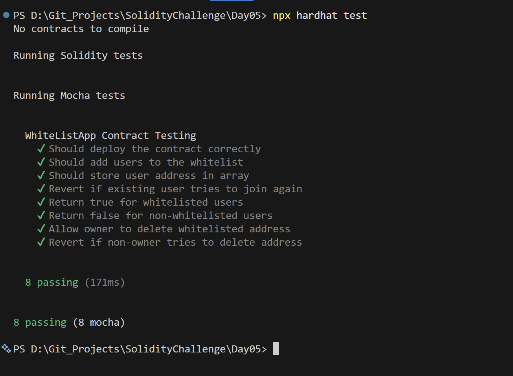

# Day 05 - White List App

## Overview
White List App is a Solidity smart contract for maintaining a whitelist of approved addresses. It is built as an access-control exercise that demonstrates membership tracking on-chain.

## Smart Contract Purpose
The contract lets the owner add approved addresses, check whether a user is whitelisted, and remove entries when needed. It is a practical example of simple permissioned storage.

## Features
- **Whitelist Enrollment**: Add an address to the whitelist.
- **Duplicate Prevention**: Prevent duplicate whitelist entries.
- **Enrollment Verification**: Check whether an address is whitelisted.
- **Address Removal**: Delete an approved address.
- **Access Control**: Restrict management actions to the owner.

## Folder Structure & Contracts
The repository layout contains:

```
Day05/
├── contracts/
│   └── WhiteListApp.sol    # Core smart contract code
├── test/
│   └── WhiteListApp.ts            # Unit test suite
├── scripts/
│   └── send-op-tx.ts         # Script to execute operations
├── ignition/
│   └── modules/
│       └── WhiteListApp.ts # Hardhat Ignition deployment module
└── screenshots/              # Execution screenshots (deployment, tests)
```

### Purpose of the Contract
- **WhiteListApp**: Maintains a secure list of authorized wallet addresses for permissioned dApps, permitting the owner to add or remove users and query whitelist status.

## Concepts Practiced
- Address arrays and membership checks.
- Ownership-based access control.
- Ignition deployment to Sepolia.
- Mocha and Chai test coverage.
- Safe duplicate prevention in storage.

## Project Summary
- **Language used**: Solidity 0.8.28 and TypeScript.
- **Tools used**: Hardhat, Hardhat Ignition, ethers v6, Mocha, Chai, and forge-std.
- **Contract name**: WhiteListApp.
- **Testing**: Hardhat test suite passed successfully.
- **Deployment status**: Deployed to Sepolia and verified on Blockscout.

## Deployment
- **Network**: Sepolia testnet.
- **Deployed contract address**: 0x22D27B05Fa8a93891d0ca8ED1dCef2D3e6090eD9
- **Verification**: Successfully verified on Blockscout.

## Screenshots

**Intialization** : npx hardhat --init



**Deployemnt** : npx hardhat ignition deploy ./ignition/modules/WhiteListApp.ts --network sepolia --verify



**Testing Contracts** : npx hardhat test


