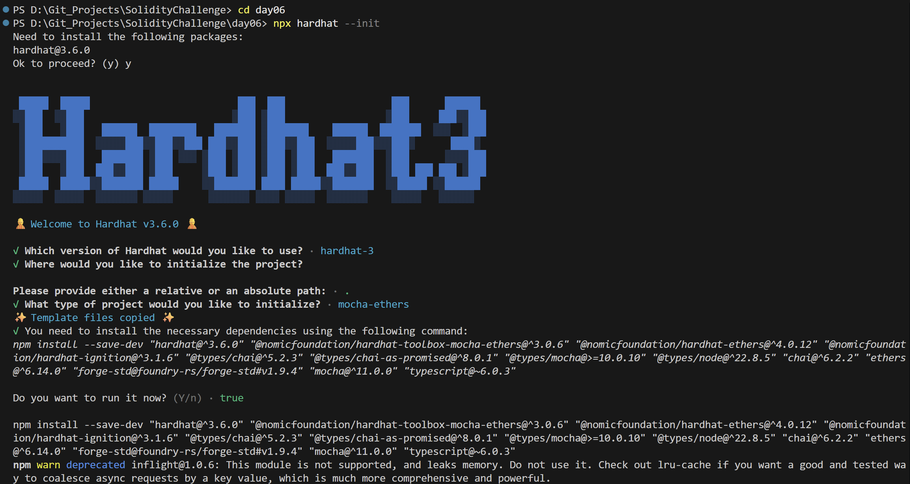
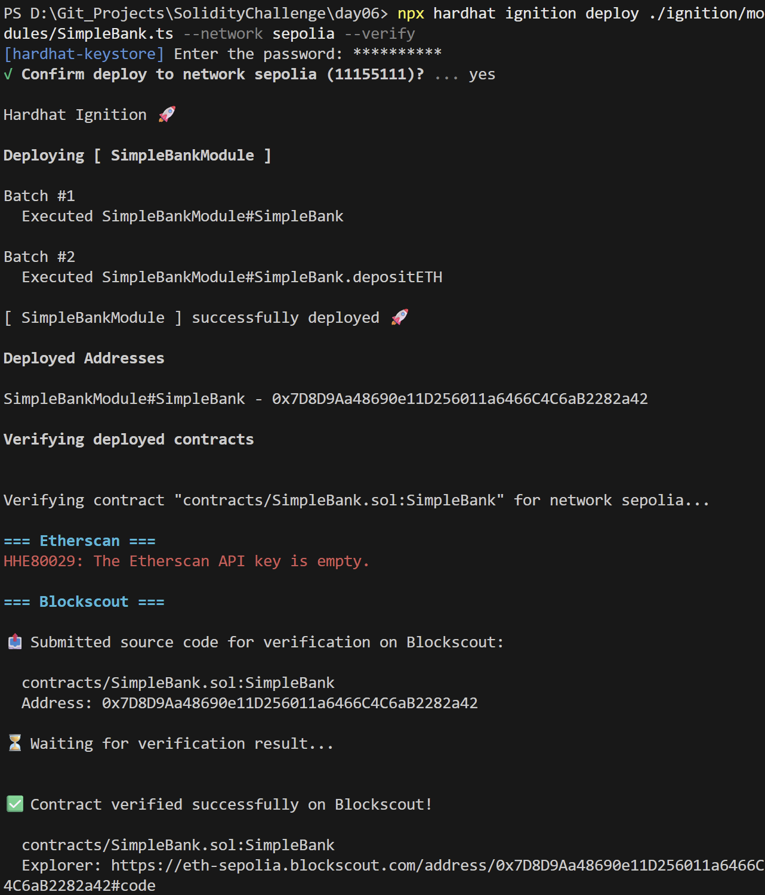
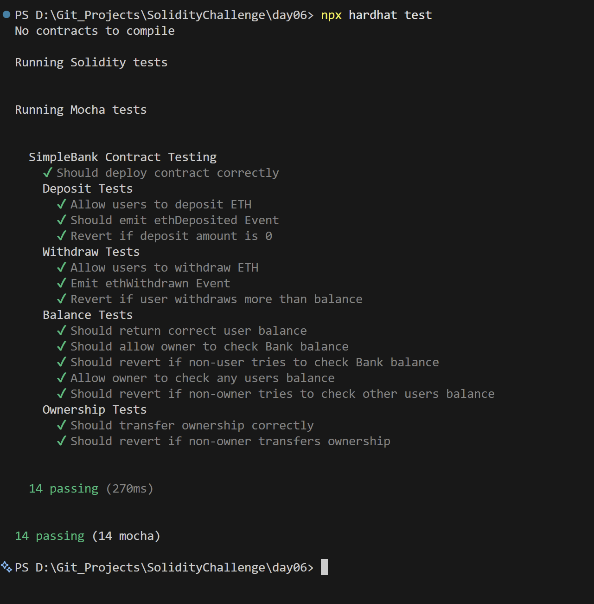

# Day 06 - Simple Bank

## Overview
Simple Bank is a Solidity smart contract for depositing, withdrawing, and inspecting ETH balances. It is a compact DeFi-style exercise that focuses on custody, balance accounting, and ownership checks.

## Smart Contract Purpose
The contract gives users a basic on-chain bank account where they can deposit ETH, withdraw funds, and check balances while the owner can inspect bank-wide totals.

## Features
- **Deposit Funds**: Deposit ETH into the contract.
- **Withdraw Funds**: Withdraw ETH from a user balance.
- **Safety Reverts**: Revert on invalid deposits or over-withdrawals.
- **Balance Queries**: Check personal and contract balances.
- **Ownership Handovers**: Transfer ownership of the contract.

## Folder Structure & Contracts
The repository layout contains:

```
Day06/
├── contracts/
│   └── SimpleBank.sol    # Core smart contract code
├── test/
│   └── SimpleBank.ts            # Unit test suite
├── scripts/
│   └── send-op-tx.ts         # Script to execute operations
├── ignition/
│   └── modules/
│       └── SimpleBank.ts # Hardhat Ignition deployment module
└── screenshots/              # Execution screenshots (deployment, tests)
```

### Purpose of the Contract
- **SimpleBank**: Simulates basic deposit and withdrawal banking activities on-chain, tracking user balances, enforcing safety limits, and preventing over-withdrawal.

## Concepts Practiced
- Payable functions and value transfer.
- Access control and ownership transfer.
- ETH balance accounting.
- Hardhat Ignition deployment and testing.
- Sepolia deployment and verification.

## Project Summary
- Language used: Solidity 0.8.28 and TypeScript.
- Tools used: Hardhat, Hardhat Ignition, ethers v6, Mocha, Chai, and forge-std.
- Contract name: SimpleBank.
- Testing: Hardhat test suite passed successfully.
- Deployment status: Deployed to Sepolia and verified on Blockscout.

## Deployment
- Network: Sepolia testnet.
- Deployed contract address: 0x7D8D9Aa48690e11D256011a6466C4C6aB2282a42
- Verification: Successfully verified on Blockscout.

## Screenshots

**Intialization** : npx hardhat --init



**Deployemnt** : npx hardhat ignition deploy ./ignition/modules/SimpleAuction.ts --network sepolia --verify



**Testing Contracts** : npx hardhat test


