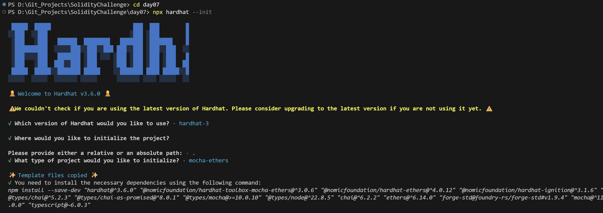
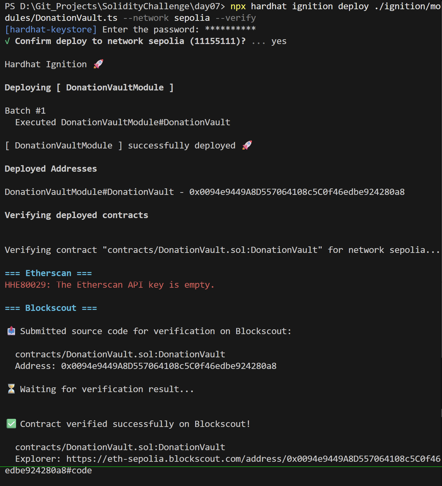
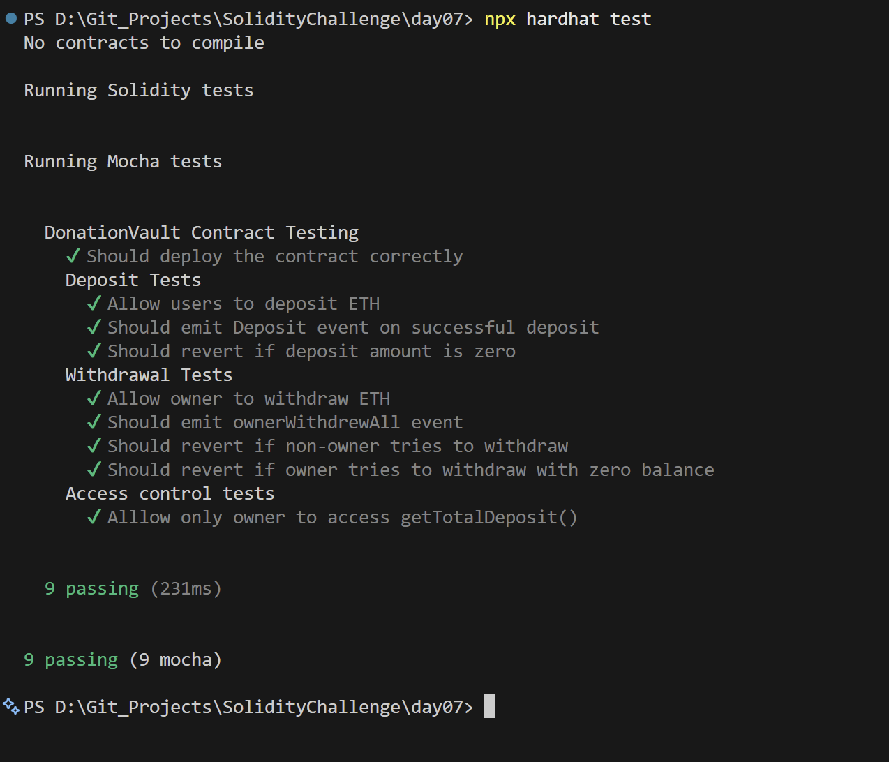

# Day 07 - Donation Vault

## Overview
Donation Vault is a Solidity smart contract for receiving and tracking ETH donations. It demonstrates a simple vault pattern with owner-controlled withdrawals and donation events.

## Smart Contract Purpose
The contract collects donations from users, records incoming ETH, and lets the owner withdraw the accumulated balance when needed.

## Features
- **ETH Donations**: Accept ETH donations.
- **Activity Auditing**: Track contract and donation activity.
- **Event Emission**: Emit events for deposits and owner withdrawals.
- **Administrative Access**: Restrict withdrawal actions to the owner.
- **Security Reverts**: Revert on unauthorized withdrawal attempts.

## Folder Structure & Contracts
The repository layout contains:

```
Day07/
├── contracts/
│   └── DonationVault.sol    # Core smart contract code
├── test/
│   └── DonationVault.ts            # Unit test suite
├── scripts/
│   └── send-op-tx.ts         # Script to execute operations
├── ignition/
│   └── modules/
│       └── DonationVault.ts # Hardhat Ignition deployment module
└── screenshots/              # Execution screenshots (deployment, tests)
```

### Purpose of the Contract
- **DonationVault**: Acts as a public donation box, accumulating ETH from multiple donors, tracking total deposits, and restricting withdrawals strictly to the vault owner.

## Concepts Practiced
- Payable contract design.
- Event emission for financial activity.
- Access control around withdrawals.
- Hardhat Ignition deployment and tests.
- Sepolia deployment and verification.

## Project Summary
- Language used: Solidity 0.8.28 and TypeScript.
- Tools used: Hardhat, Hardhat Ignition, ethers v6, Mocha, Chai, and forge-std.
- Contract name: DonationVault.
- Testing: Hardhat test suite passed successfully.
- Deployment status: Deployed to Sepolia and verified on Blockscout.

## Deployment
- Network: Sepolia testnet.
- Deployed contract address: 0x0094e9449A8D557064108c5C0f46edbe924280a8
- Verification: Successfully verified on Blockscout.

## Screenshots

**Intialization** : npx hardhat --init



**Deployemnt** : npx hardhat ignition deploy ./ignition/modules/SimpleAuction.ts --network sepolia --verify



**Testing Contracts** : npx hardhat test


