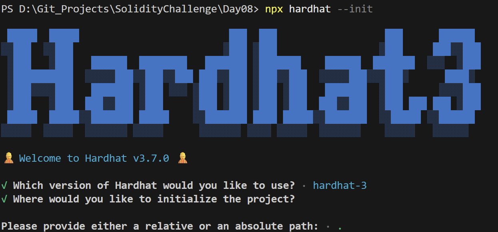
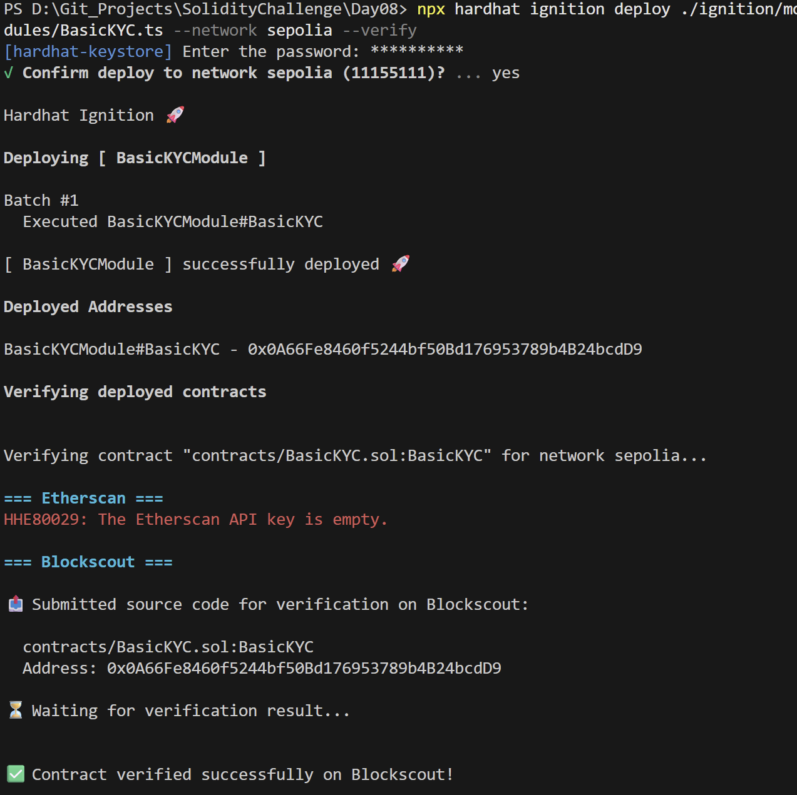
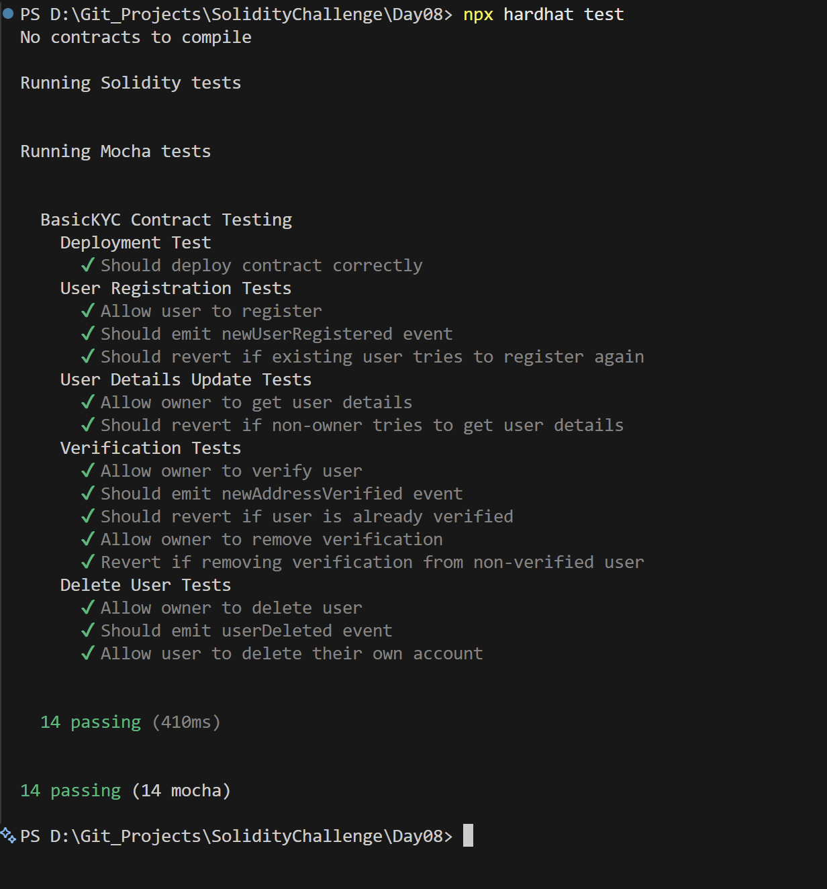

# Day 08 - Basic KYC

## Overview
Basic KYC is a Solidity smart contract for registering users, managing verification status, and removing user records. It is a compact identity and access-control example.

## Smart Contract Purpose
The contract lets an owner register users, mark them verified, remove verification, and delete user data. It models a minimal know-your-customer style workflow on-chain.

## Features
- **User Onboarding**: Register a user address.
- **Uniqueness Guards**: Prevent duplicate registrations.
- **Status Verification**: Verify or unverify a registered user.
- **Record Deletion**: Delete a user record.
- **Management Safeguards**: Restrict management functions to the owner.

## Folder Structure & Contracts
The repository layout contains:

```
Day08/
├── contracts/
│   └── BasicKYC.sol    # Core smart contract code
├── test/
│   └── BasicKYC.ts            # Unit test suite
├── scripts/
│   └── send-op-tx.ts         # Script to execute operations
├── ignition/
│   └── modules/
│       └── BasicKYC.ts # Hardhat Ignition deployment module
└── screenshots/              # Execution screenshots (deployment, tests)
```

### Purpose of the Contract
- **BasicKYC**: Provides a basic KYC verification directory, allowing an admin/owner to register addresses, toggle their verified state, and check verification status on-chain.

## Concepts Practiced
- On-chain identity records.
- Role-based access control.
- Revert handling for duplicate and invalid states.
- Hardhat Ignition deployment and testing.
- Sepolia deployment and verification.

## Project Summary
- Language used: Solidity 0.8.28 and TypeScript.
- Tools used: Hardhat, Hardhat Ignition, ethers v6, Mocha, Chai, and forge-std.
- Contract name: BasicKYC.
- Testing: Hardhat test suite passed successfully.
- Deployment status: Deployed to Sepolia and verified on Blockscout.

## Deployment
- Network: Sepolia testnet.
- Deployed contract address: 0x0A66Fe8460f5244bf50Bd176953789b4B24bcdD9
- Verification: Successfully verified on Blockscout.

## Screenshots

**Intialization** : npx hardhat --init



**Deployemnt** : npx hardhat ignition deploy ./ignition/modules/SimpleAuction.ts --network sepolia --verify



**Testing Contracts** : npx hardhat test


