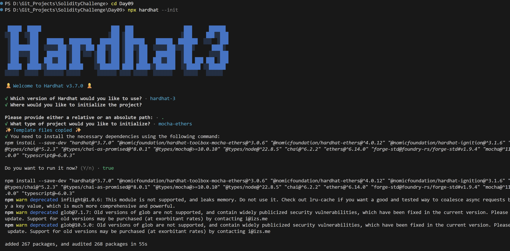
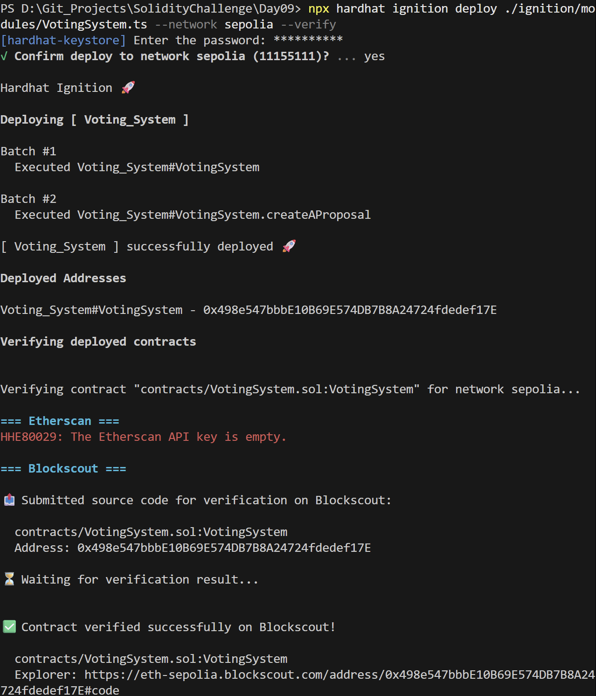
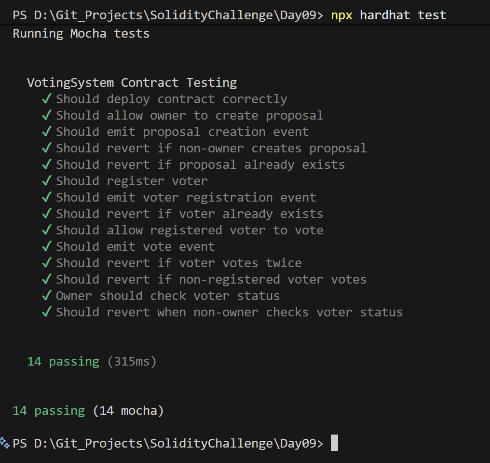

# Day 09 - Voting System

## Overview
Voting System is a Solidity smart contract for creating proposals, registering voters, and collecting votes on-chain. It is a simple governance exercise with role separation and vote tracking.

## Smart Contract Purpose
The contract lets the owner create a proposal, register voters, and then gather votes from approved participants while preventing double voting.

## Features
- **Proposal Management**: Create a proposal.
- **Voter Onboarding**: Register eligible voters.
- **Vote Casting**: Allow registered voters to vote.
- **Double-Vote Guards**: Prevent duplicate voting.
- **Owner Monitoring**: Expose voter status checks for the owner.

## Folder Structure & Contracts
The repository layout contains:

```
Day09/
├── contracts/
│   └── VotingSystem.sol    # Core smart contract code
├── test/
│   └── VotingSystem.ts            # Unit test suite
├── scripts/
│   └── send-op-tx.ts         # Script to execute operations
├── ignition/
│   └── modules/
│       └── VotingSystem.ts # Hardhat Ignition deployment module
└── screenshots/              # Execution screenshots (deployment, tests)
```

### Purpose of the Contract
- **VotingSystem**: Provides an on-chain coordinator for proposals, letting an owner register eligible voter addresses, count votes, and prevent double voting.

## Concepts Practiced
- Governance-style contract design.
- Access control for proposal and voter management.
- State tracking for vote casting.
- Hardhat Ignition deployment and testing.
- Sepolia deployment and verification.

## Project Summary
- Language used: Solidity 0.8.28 and TypeScript.
- Tools used: Hardhat, Hardhat Ignition, ethers v6, Mocha, Chai, and forge-std.
- Contract name: VotingSystem.
- Testing: Hardhat test suite passed successfully.
- Deployment status: Deployed to Sepolia and verified on Blockscout.

## Deployment
- Network: Sepolia testnet.
- Deployed contract address: 0x498e547bbbE10B69E574DB7B8A24724fdedef17E
- Verification: Successfully verified on Blockscout.

## Screenshots





