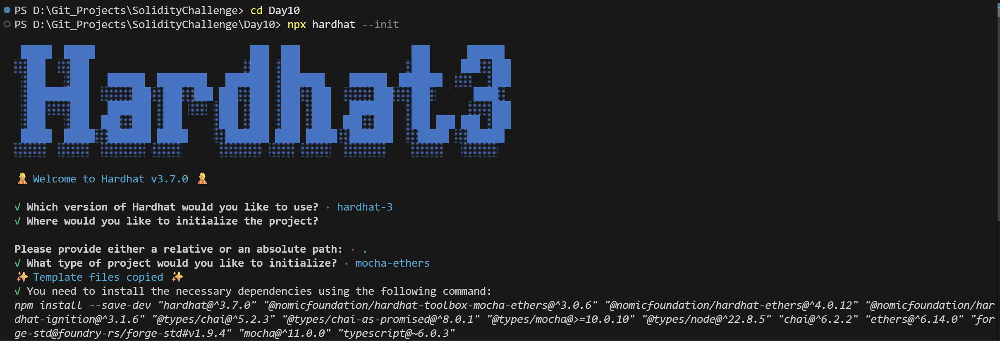
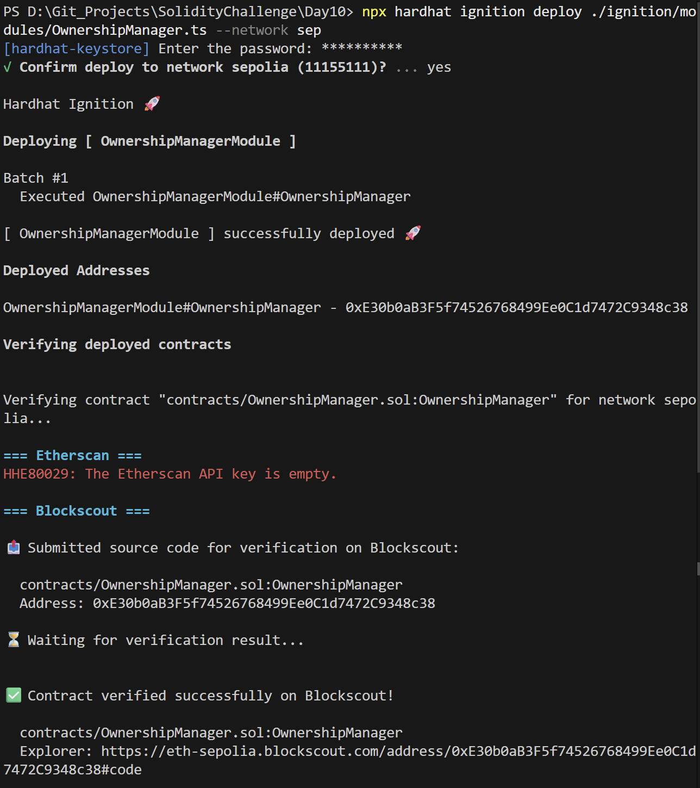
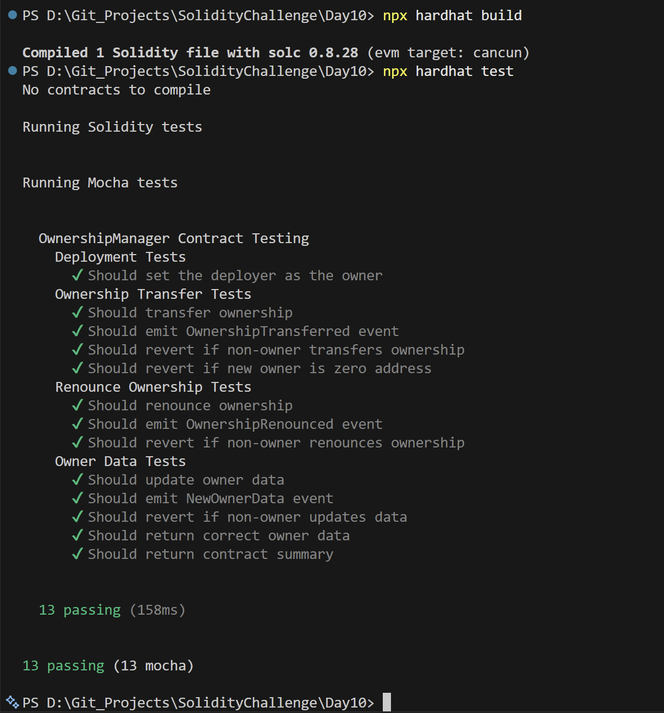

# Day 10 - Ownership Manager

## Overview
Ownership Manager is a Solidity smart contract for transferring and renouncing ownership while also storing owner metadata. It is a focused access-control project centered on admin lifecycle management.

## Smart Contract Purpose
The contract lets the deployer manage ownership, transfer control to a new owner, renounce ownership, and update owner-related data in a controlled way.

## Features
- **Ownership Transfer**: Transfer ownership to a new address.
- **Renunciation Controls**: Renounce ownership when needed.
- **Profile Updates**: Update owner profile data.
- **Event Audits**: Emit ownership-related events.
- **Administrative Guards**: Restrict privileged functions to the owner.

## Folder Structure & Contracts
The repository layout contains:

```
Day10/
├── contracts/
│   └── OwnershipManager.sol    # Core smart contract code
├── test/
│   └── OwnershipManager.ts            # Unit test suite
├── scripts/
│   └── send-op-tx.ts         # Script to execute operations
├── ignition/
│   └── modules/
│       └── OwnershipManager.ts # Hardhat Ignition deployment module
└── screenshots/              # Execution screenshots (deployment, tests)
```

### Purpose of the Contract
- **OwnershipManager**: Implements a robust ownership administration module, enabling secure contract transfers, renounce options, and ownership event logs.

## Concepts Practiced
- Ownership-based authorization.
- Event-driven state changes.
- Admin metadata updates.
- Hardhat Ignition deployment and testing.
- Sepolia deployment and verification.

## Project Summary
- Language used: Solidity 0.8.28 and TypeScript.
- Tools used: Hardhat, Hardhat Ignition, ethers v6, Mocha, Chai, and forge-std.
- Contract name: OwnershipManager.
- Testing: Hardhat test suite passed successfully.
- Deployment status: Deployed to Sepolia and verified on Blockscout.

## Deployment
- Network: Sepolia testnet.
- Deployed contract address: 0xE30b0aB3F5f74526768499Ee0C1d7472C9348c38
- Verification: Successfully verified on Blockscout.

## Screenshots





