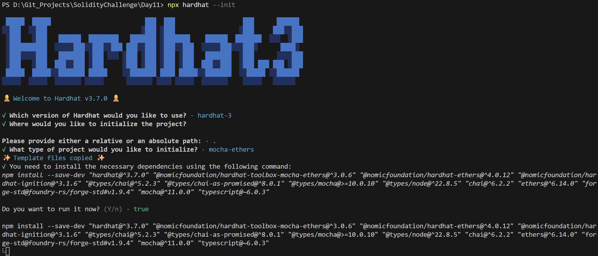
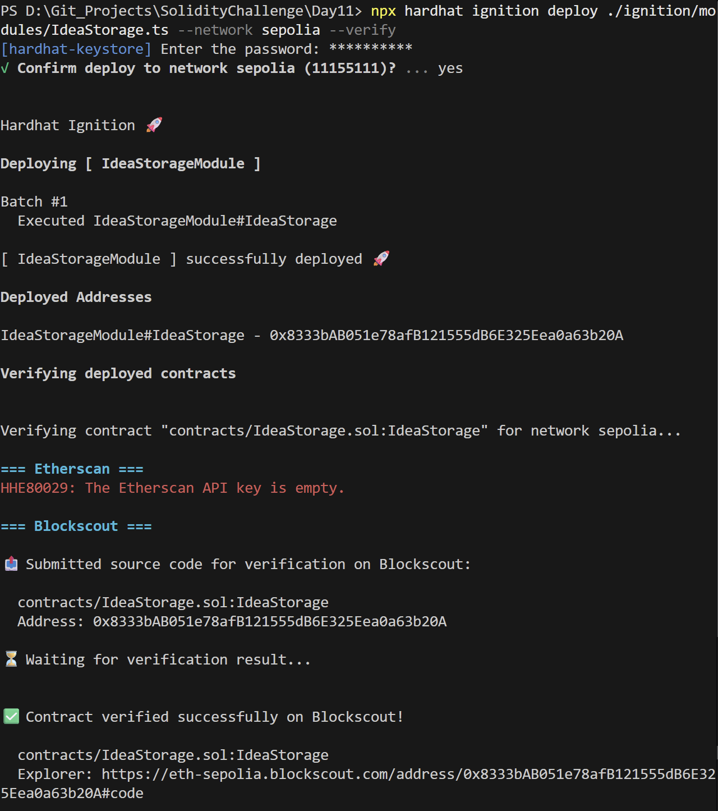
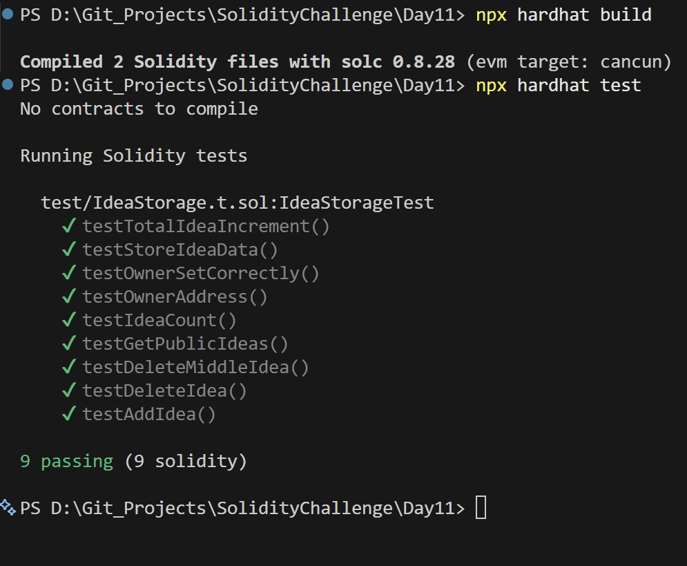

# Day 11 - Idea Storage

## Overview
Idea Storage is a Solidity smart contract for saving, updating, and deleting user ideas on-chain. It acts as a lightweight personal notes vault with simple ownership checks.

## Smart Contract Purpose
The contract lets a user persist ideas on-chain, retrieve them later, update existing entries, and remove entries when they are no longer needed.

## Features
- **Idea Vaulting**: Store an idea on-chain.
- **Idea Queries**: Retrieve saved ideas.
- **Idea Editing**: Update existing idea data.
- **Idea Deletion**: Delete stored ideas.
- **Private Access**: Keep user data isolated by address.

## Folder Structure & Contracts
The repository layout contains:

```
Day11/
├── contracts/
│   └── IdeaStorage.sol    # Core smart contract code
├── test/
│   └── IdeaStorage.t.sol            # Unit test suite
├── scripts/
│   └── send-op-tx.ts         # Script to execute operations
├── ignition/
│   └── modules/
│       └── IdeaStorage.ts # Hardhat Ignition deployment module
└── screenshots/              # Execution screenshots (deployment, tests)
```

### Purpose of the Contract
- **IdeaStorage**: Provides a private, address-isolated brainstorming vault where users register intellectual ideas, retrieve listings, and update/delete records.

## Concepts Practiced
- Dynamic storage management.
- CRUD patterns in Solidity.
- Hardhat Ignition deployment and verification.
- Mocha and Chai test coverage.
- Sepolia testnet deployment.

## Project Summary
- Language used: Solidity 0.8.28 and TypeScript.
- Tools used: Hardhat, Hardhat Ignition, ethers v6, Mocha, Chai, and forge-std.
- Contract name: IdeaStorage.
- Testing: Solidity and Hardhat tests passed successfully.
- Deployment status: Deployed to Sepolia and verified on Blockscout.

## Deployment
- Network: Sepolia testnet.
- Deployed contract address: 0x8333bAB051e78afB121555dB6E325Eea0a63b20A
- Verification: Successfully verified on Blockscout.

## Screenshots

**Intialization** : npx hardhat --init



**Deployemnt** : npx hardhat ignition deploy ./ignition/modules/SimpleAuction.ts --network sepolia --verify



**Testing Contracts** : npx hardhat test


