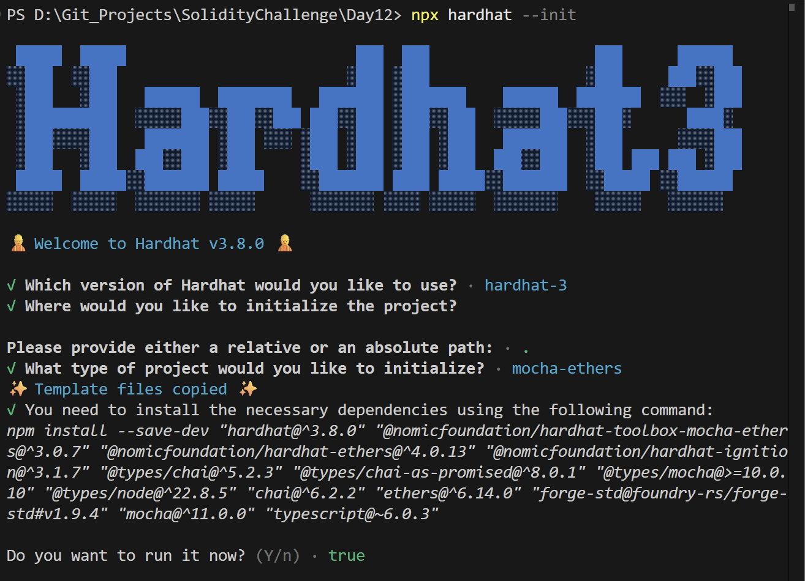
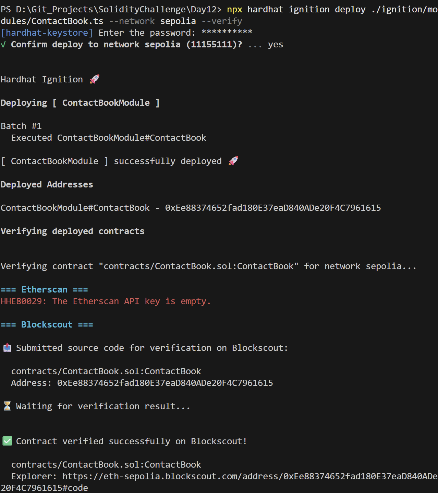
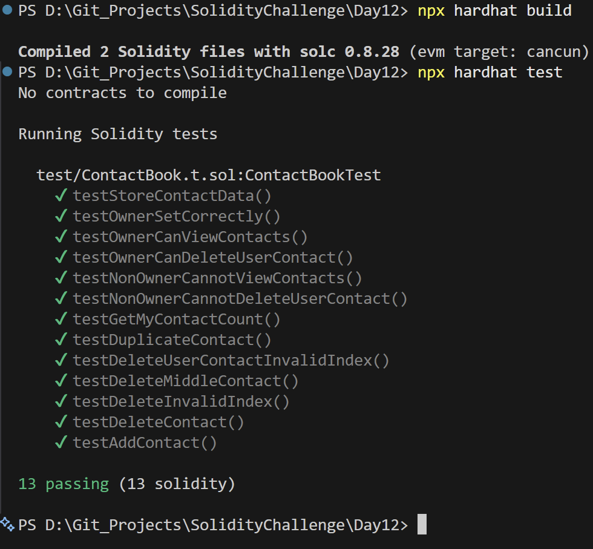

# Day 12 - Contact Book

## Overview
Contact Book is a Solidity smart contract for storing contacts, updating records, and removing entries. It is a small on-chain address book with ownership-protected actions.

## Smart Contract Purpose
The contract lets the owner store contact information, manage updates, and delete records while users can keep their own entries isolated and retrievable.

## Features
- **Contact Storage**: Store contact data.
- **Contact Queries**: Retrieve contact records.
- **Contact Editing**: Update existing contacts.
- **Contact Deletion**: Delete selected contacts.
- **Owner Authorization**: Prevent unauthorized access to owner-only actions.

## Folder Structure & Contracts
The repository layout contains:

```
Day12/
├── contracts/
│   └── ContactBook.sol    # Core smart contract code
├── test/
│   └── ContactBook.t.sol            # Unit test suite
├── scripts/
│   └── send-op-tx.ts         # Script to execute operations
├── ignition/
│   └── modules/
│       └── ContactBook.ts # Hardhat Ignition deployment module
└── screenshots/              # Execution screenshots (deployment, tests)
```

### Purpose of the Contract
- **ContactBook**: Acts as a personal address book ledger, allowing users to save their contacts (names, phone numbers, or metadata) securely and privately on-chain.

## Concepts Practiced
- Structured data storage.
- CRUD workflows with access control.
- Hardhat Ignition deployment and verification.
- Mocha and Chai testing.
- Sepolia deployment and Blockscout verification.

## Project Summary
- Language used: Solidity 0.8.28 and TypeScript.
- Tools used: Hardhat, Hardhat Ignition, ethers v6, Mocha, Chai, and forge-std.
- Contract name: ContactBook.
- Testing: Solidity and Hardhat tests passed successfully.
- Deployment status: Deployed to Sepolia and verified on Blockscout.

## Deployment
- Network: Sepolia testnet.
- Deployed contract address: 0xEe88374652fad180E37eaD840ADe20F4C7961615
- Verification: Successfully verified on Blockscout.

## Screenshots

**Intialization** : npx hardhat --init



**Deployemnt** : npx hardhat ignition deploy ./ignition/modules/SimpleAuction.ts --network sepolia --verify



**Testing Contracts** : npx hardhat test


