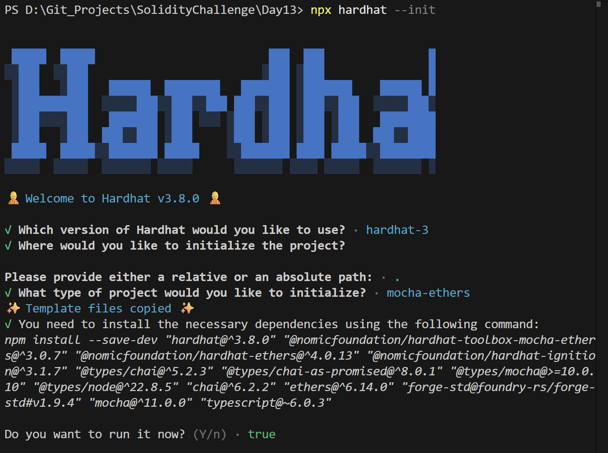
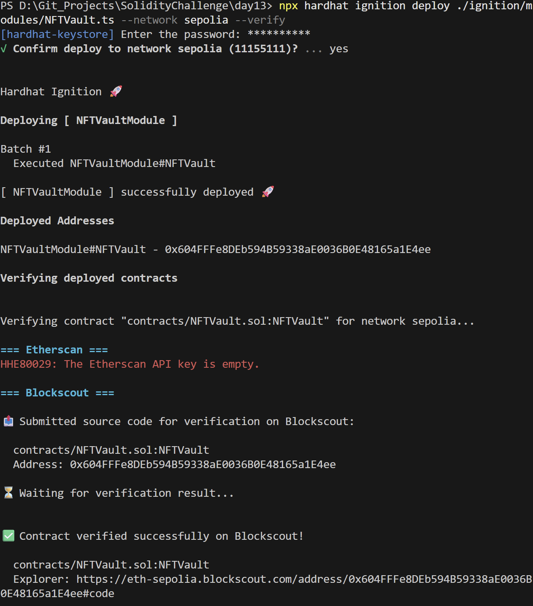
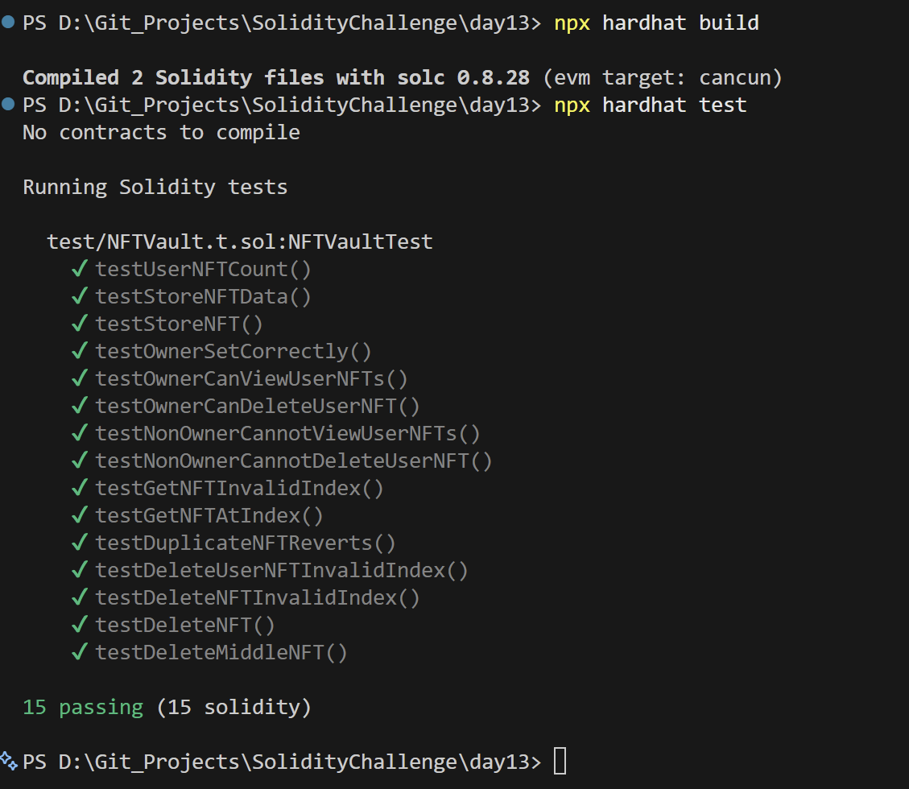

# Day 13 - NFT Vault

## Overview
NFT Vault is a Solidity smart contract for storing NFT ownership records and managing user collections on-chain. It is a simple asset registry exercise that demonstrates token tracking by owner.

## Smart Contract Purpose
The contract lets users store NFT information, retrieve their saved NFTs, update records, and remove items from storage when they no longer want them tracked.

## Features
- **NFT Storage**: Store NFT data for a user.
- **Owner Queries**: Retrieve NFTs by owner.
- **Metadata Management**: Update NFT metadata records.
- **Metadata Deletion**: Delete stored NFTs.
- **Access Guards**: Enforce owner-based access for management operations.

## Folder Structure & Contracts
The repository layout contains:

```
Day13/
├── contracts/
│   └── NFTVault.sol    # Core smart contract code
├── test/
│   └── NFTVault.t.sol            # Unit test suite
├── scripts/
│   └── send-op-tx.ts         # Script to execute operations
├── ignition/
│   └── modules/
│       └── NFTVault.ts # Hardhat Ignition deployment module
└── screenshots/              # Execution screenshots (deployment, tests)
```

### Purpose of the Contract
- **NFTVault**: Provides a secure registry for mapping NFTs to user addresses, updating metadata details, and deleting vault references.

## Concepts Practiced
- Structured asset storage.
- Owner-scoped retrieval and deletion.
- Hardhat Ignition deployment and verification.
- Solidity and Hardhat test coverage.
- Sepolia testnet deployment.

## Project Summary
- Language used: Solidity 0.8.28 and TypeScript.
- Tools used: Hardhat, Hardhat Ignition, ethers v6, Mocha, Chai, and forge-std.
- Contract name: NFTVault.
- Testing: Solidity and Hardhat tests passed successfully.
- Deployment status: Deployed to Sepolia and verified on Blockscout.

## Deployment
- Network: Sepolia testnet.
- Deployed contract address: 0x604FFFe8DEb594B59338aE0036B0E48165a1E4ee
- Verification: Successfully verified on Blockscout.

## Screenshots





