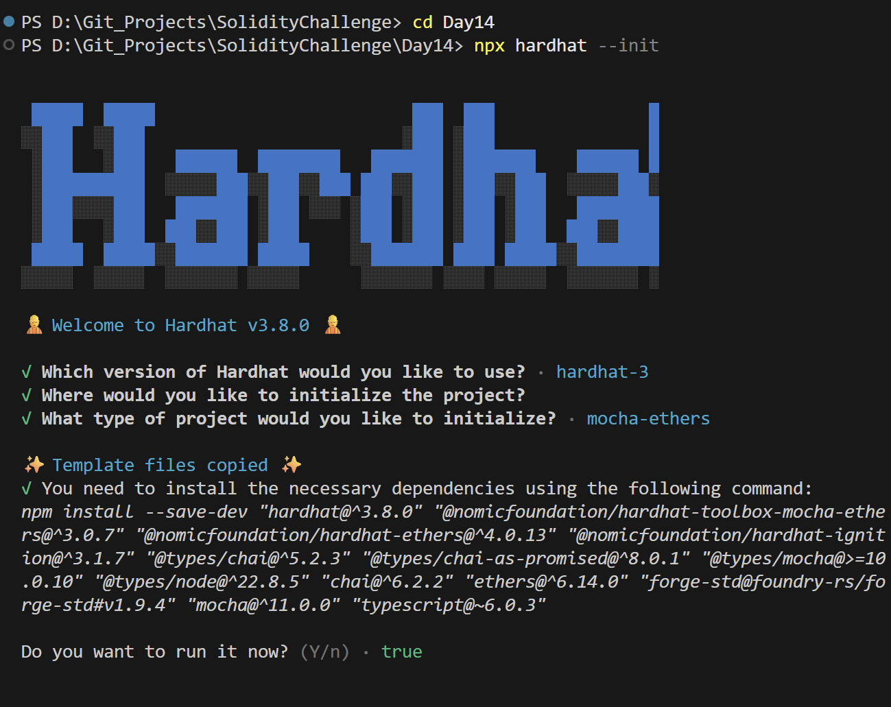
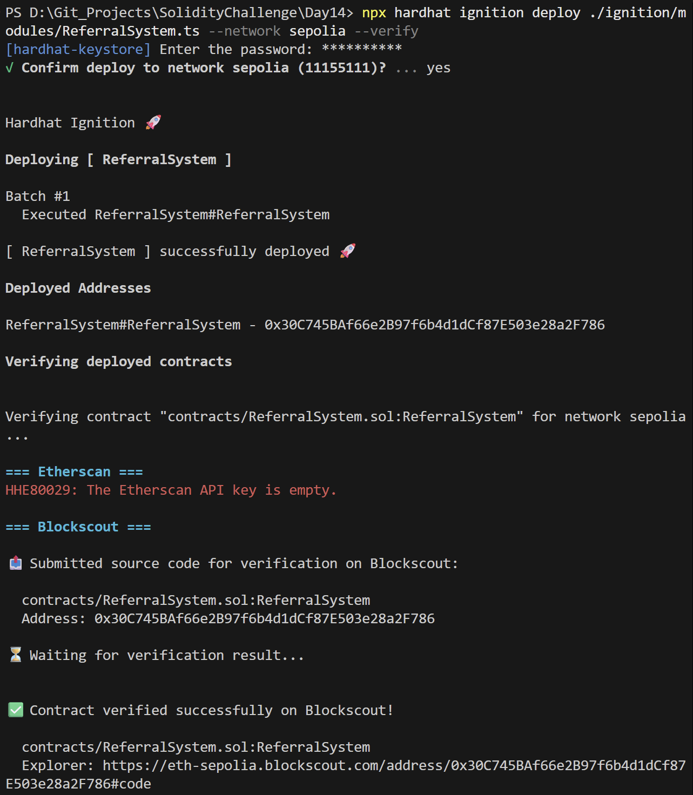
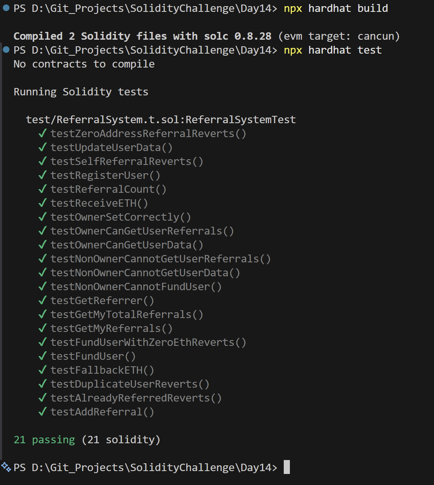

# Day 14 - Referral System

## Overview
Referral System is a Solidity smart contract for registering users, linking referral relationships, and tracking referral counts on-chain. It is a network-growth exercise with simple incentive-style bookkeeping.

## Smart Contract Purpose
The contract lets a user register, set a referrer, track referral relationships, and let the owner inspect referral data for management and rewards logic.

## Features
- **User Onboarding**: Register a user.
- **Referrer Mapping**: Store a referrer relationship.
- **Referral Audits**: Track referral counts.
- **Profile Customization**: Update user data.
- **Admin Restrictions**: Restrict sensitive queries to the owner.

## Folder Structure & Contracts
The repository layout contains:

```
Day14/
├── contracts/
│   └── ReferralSystem.sol    # Core smart contract code
├── test/
│   └── ReferralSystem.t.sol            # Unit test suite
├── scripts/
│   └── send-op-tx.ts         # Script to execute operations
├── ignition/
│   └── modules/
│       └── ReferralSystem.ts # Hardhat Ignition deployment module
└── screenshots/              # Execution screenshots (deployment, tests)
```

### Purpose of the Contract
- **ReferralSystem**: Implements a simple referral tree on-chain, recording referrers, mapping user invitations, and tracking total invitation counts per address.

## Concepts Practiced
- Relationship tracking in Solidity.
- Access control for user data.
- On-chain referral bookkeeping.
- Hardhat Ignition deployment and testing.
- Sepolia deployment and verification.

## Project Summary
- Language used: Solidity 0.8.28 and TypeScript.
- Tools used: Hardhat, Hardhat Ignition, ethers v6, Mocha, Chai, and forge-std.
- Contract name: ReferralSystem.
- Testing: Solidity and Hardhat tests passed successfully.
- Deployment status: Deployed to Sepolia and verified on Blockscout.

## Deployment
- Network: Sepolia testnet.
- Deployed contract address: 0x30C745BAf66e2B97f6b4d1dCf87E503e28a2F786
- Verification: Successfully verified on Blockscout.

## Screenshots

**Intialization** : npx hardhat --init



**Deployemnt** : npx hardhat ignition deploy ./ignition/modules/SimpleAuction.ts --network sepolia --verify



**Testing Contracts** : npx hardhat test


