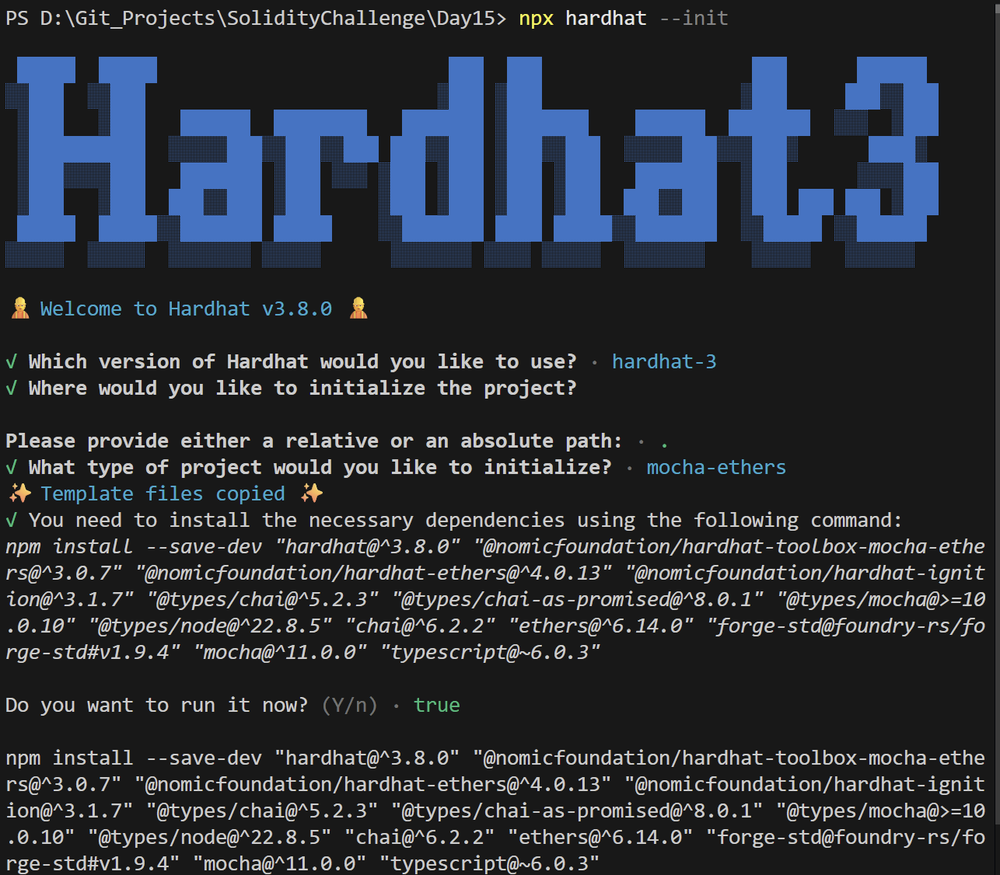
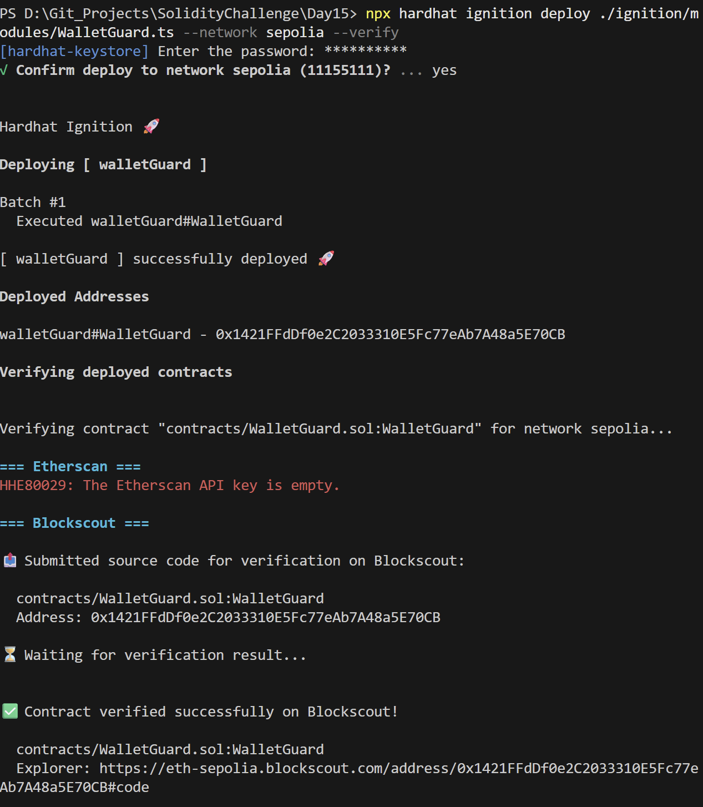
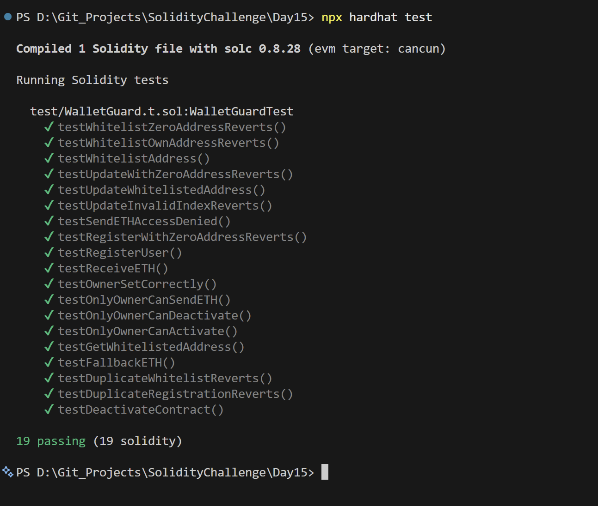

# Day 15 - Wallet Guard

## Overview
Wallet Guard is a Solidity smart contract for protecting a wallet with whitelist controls, activation state, and ETH transfer restrictions. It is a security-focused access-control exercise.

## Smart Contract Purpose
The contract allows the owner to activate or deactivate the wallet, manage whitelisted addresses, and control who can send ETH or access protected functions.

## Features
- **Access Control**: Add and remove whitelisted addresses.
- **Duplicate Prevention**: Prevent duplicate whitelist entries.
- **Contract Controls**: Activate and deactivate the contract.
- **Transfer Permissions**: Restrict ETH sending to authorized users.
- **Safety Guarding**: Guard sensitive transfer and management actions.

## Folder Structure & Contracts
The repository layout contains:

```
Day15/
├── contracts/
│   └── WalletGuard.sol    # Core smart contract code
├── test/
│   └── WalletGuard.t.sol            # Unit test suite
├── scripts/
│   └── send-op-tx.ts         # Script to execute operations
├── ignition/
│   └── modules/
│       └── WalletGuard.ts # Hardhat Ignition deployment module
└── screenshots/              # Execution screenshots (deployment, tests)
```

### Purpose of the Contract
- **WalletGuard**: Provides a guarded multisig or access control system, locking and unlocking transaction operations, maintaining a whitelist, and securing outgoing funds.

## Concepts Practiced
- Whitelist-based authorization.
- Contract lifecycle management.
- ETH transfer restrictions and fallback handling.
- Hardhat Ignition deployment and verification.
- Sepolia deployment and testing.

## Project Summary
- Language used: Solidity 0.8.28 and TypeScript.
- Tools used: Hardhat, Hardhat Ignition, ethers v6, Mocha, Chai, and forge-std.
- Contract name: WalletGuard.
- Testing: Solidity and Hardhat tests passed successfully.
- Deployment status: Deployed to Sepolia and verified on Blockscout.

## Deployment
- Network: Sepolia testnet.
- Deployed contract address: 0x1421FFdDf0e2C2033310E5Fc77eAb7A48a5E70CB
- Verification: Successfully verified on Blockscout.

## Screenshots





