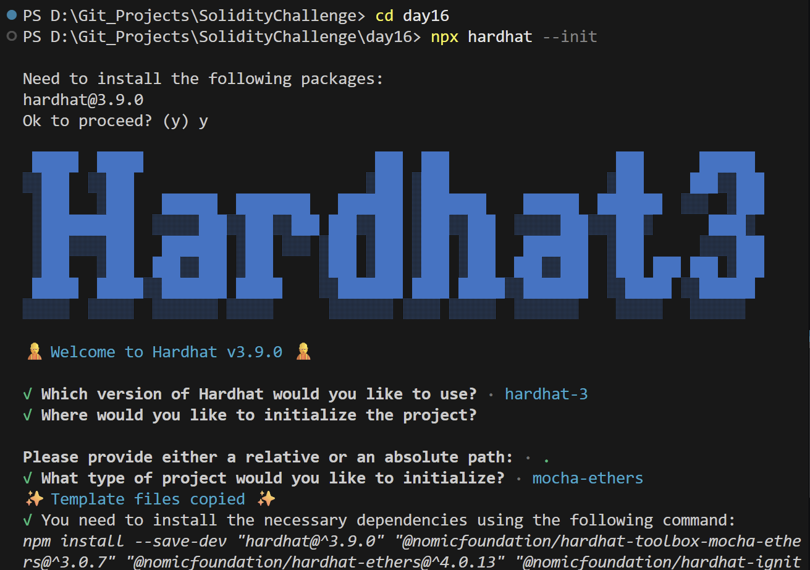
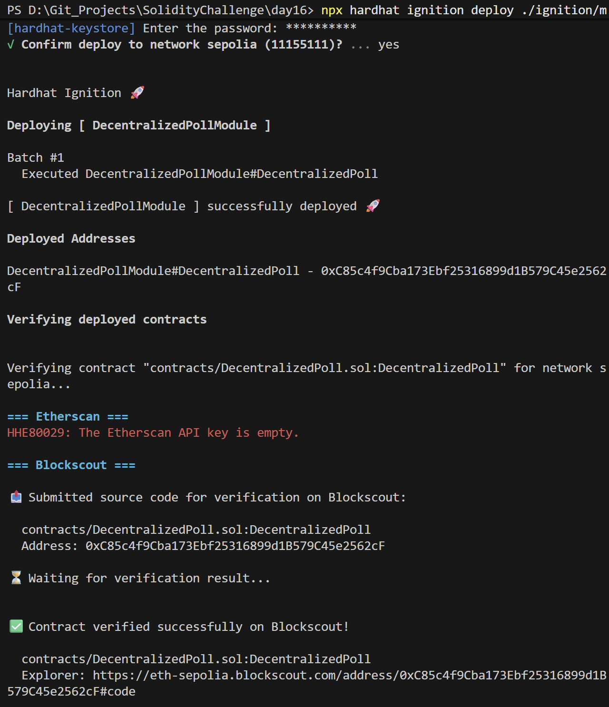
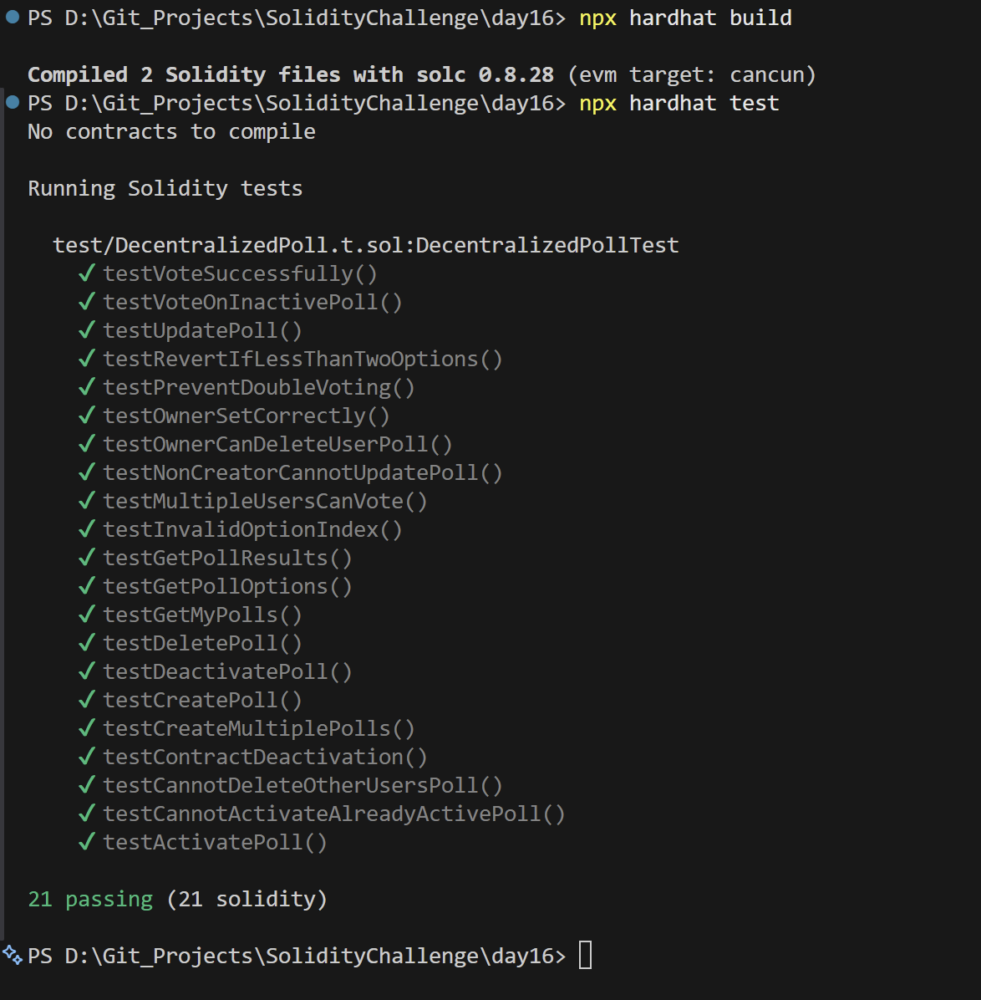

# Day 16 - Decentralized Poll

## Overview
Decentralized Poll is a Solidity smart contract for creating polls, voting on options, and managing poll lifecycle state on-chain. It is a governance-style project with multi-poll support.

## Smart Contract Purpose
The contract allows users to create polls, register votes, update poll data, and manage active or inactive poll state in a decentralized workflow.

## Features
- **Poll Creation**: Create a poll.
- **Multi-Poll Framework**: Create multiple polls.
- **Vote Logging**: Vote on available options.
- **Double-Voting Prevention**: Prevent duplicate voting.
- **Poll Activations**: Activate and deactivate poll records.

## Folder Structure & Contracts
The repository layout contains:

```
Day16/
├── contracts/
│   └── DecentralizedPoll.sol    # Core smart contract code
├── test/
│   └── DecentralizedPoll.t.sol            # Unit test suite
├── scripts/
│   └── send-op-tx.ts         # Script to execute operations
├── ignition/
│   └── modules/
│       └── DecentralizedPoll.ts # Hardhat Ignition deployment module
└── screenshots/              # Execution screenshots (deployment, tests)
```

### Purpose of the Contract
- **DecentralizedPoll**: Manages multiple independent decentralized polls where users cast unique votes on options, tracking tallies and toggling poll active states.

## Concepts Practiced
- Poll lifecycle management.
- Option indexing and vote counting.
- Access control around poll creation and cleanup.
- Hardhat Ignition deployment and testing.
- Sepolia deployment and verification.

## Project Summary
- **Language used**: Solidity 0.8.28 and TypeScript.
- **Tools used**: Hardhat, Hardhat Ignition, ethers v6, Mocha, Chai, and forge-std.
- **Contract name**: DecentralizedPoll.
- **Testing**: Solidity and Hardhat tests passed successfully.
- **Deployment status**: Deployed to Sepolia and verified on Blockscout.

## Deployment
- **Network**: Sepolia testnet.
- **Deployed contract address**: 0xC85c4f9Cba173Ebf25316899d1B579C45e2562cF
- **Verification**: Successfully verified on Blockscout.

## Screenshots

**Intialization** : npx hardhat --init



**Deployemnt** : npx hardhat ignition deploy ./ignition/modules/DecentralizedPoll.ts --network sepolia --verify



**Testing Contracts** : npx hardhat test

