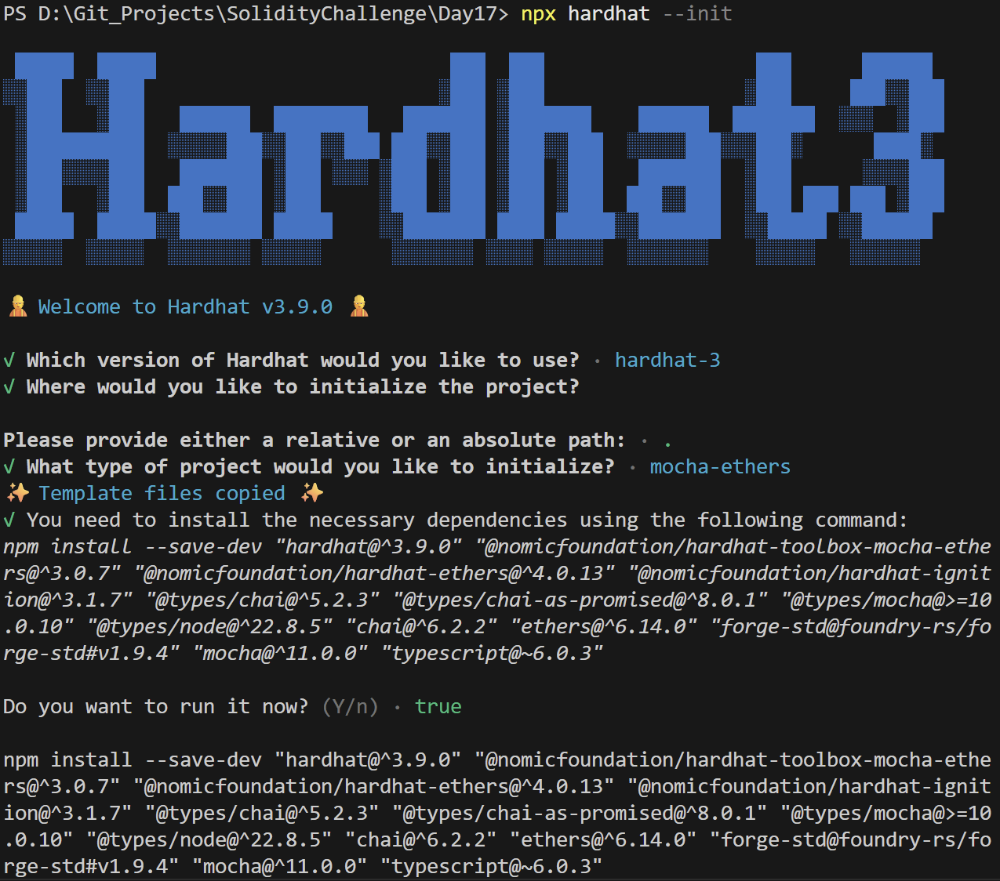
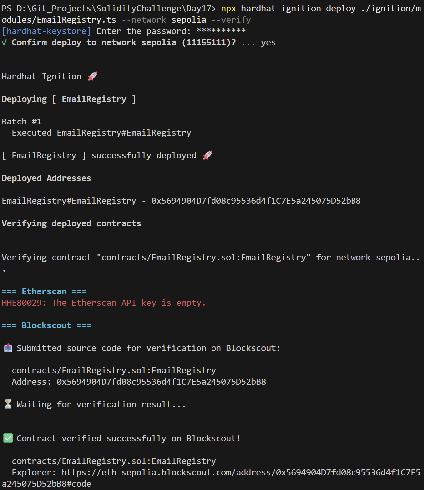
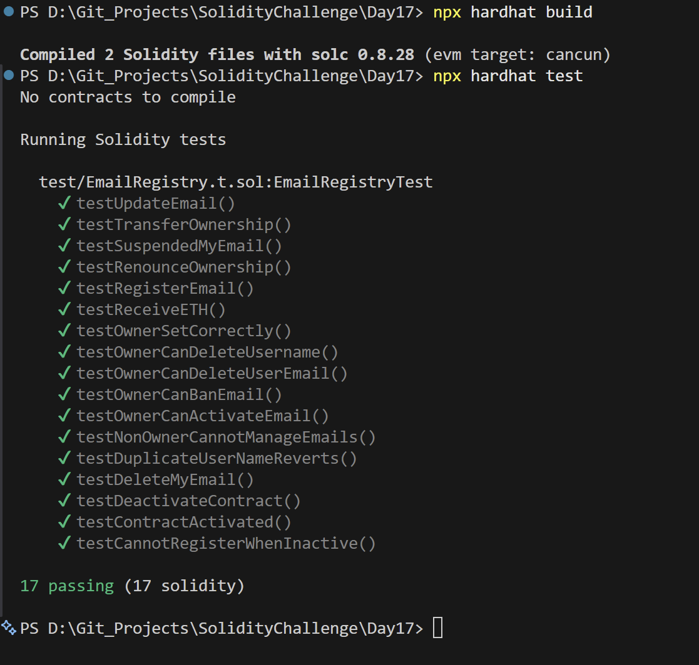

# Day 17 - Email Registry

## Overview
Email Registry is a Solidity smart contract for registering email identities, updating account details, and managing activation state on-chain. It is a privacy-aware identity registry example.

## Smart Contract Purpose
The contract lets users register an email-linked identity, update the associated data, and let the owner manage or deactivate entries when needed.

## Features
- **Email Registration**: Register an email identity.
- **Email Editing**: Update email details.
- **Status Deactivation**: Suspend or deactivate a record.
- **Duplicate Prevention**: Prevent duplicate registrations.
- **Owner Security**: Restrict registry management to the owner.

## Folder Structure & Contracts
The repository layout contains:

```
Day17/
├── contracts/
│   └── EmailRegistry.sol    # Core smart contract code
├── test/
│   └── EmailRegistry.t.sol            # Unit test suite
├── scripts/
│   └── send-op-tx.ts         # Script to execute operations
├── ignition/
│   └── modules/
│       └── EmailRegistry.ts # Hardhat Ignition deployment module
└── screenshots/              # Execution screenshots (deployment, tests)
```

### Purpose of the Contract
- **EmailRegistry**: Registers on-chain email identities, enabling user registrations, detail modifications, and owner-governed registry suspension and deactivation.

## Concepts Practiced
- Identity registry workflows.
- Event emission for account changes.
- Access control for sensitive operations.
- Hardhat Ignition deployment and testing.
- Sepolia deployment and verification.

## Project Summary
- Language used: Solidity 0.8.28 and TypeScript.
- Tools used: Hardhat, Hardhat Ignition, ethers v6, Mocha, Chai, and forge-std.
- Contract name: EmailRegistry.
- Testing: Solidity and Hardhat tests passed successfully.
- Deployment status: Deployed to Sepolia and verified on Blockscout.

## Deployment
- Network: Sepolia testnet.
- Deployed contract address: 0x5694904D7fd08c95536d4f1C7E5a245075D52bB8
- Verification: Successfully verified on Blockscout.

## Screenshots

**Intialization** : npx hardhat --init



**Deployemnt** : npx hardhat ignition deploy ./ignition/modules/SimpleAuction.ts --network sepolia --verify



**Testing Contracts** : npx hardhat test


