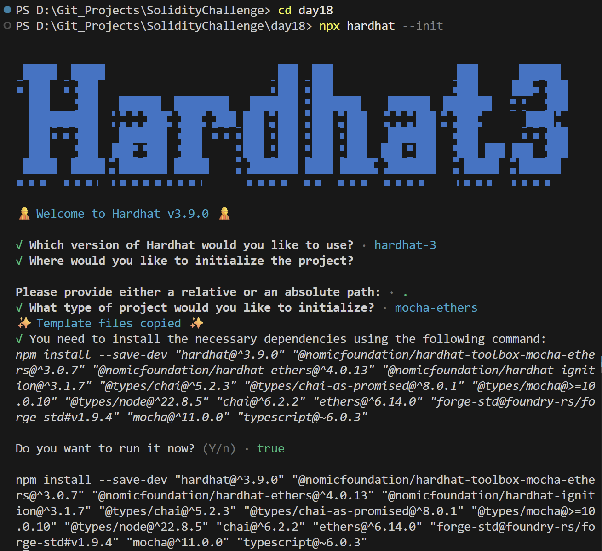
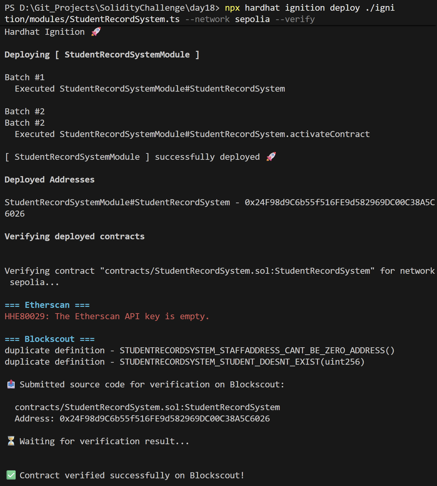
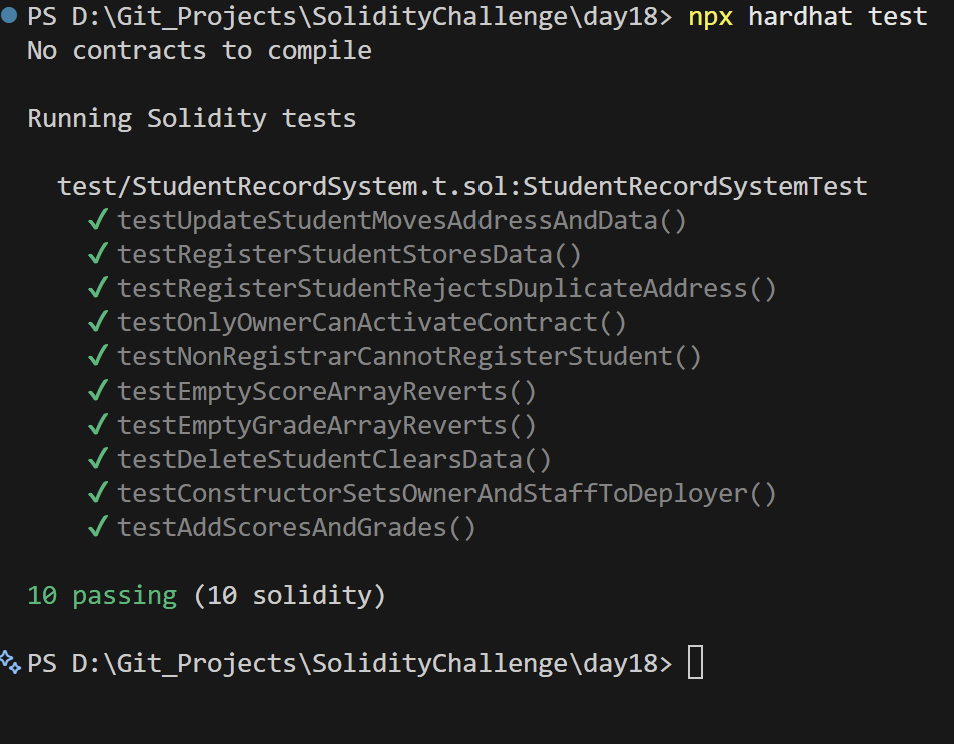

# Day 18 - Student Record System

## Overview
Student Record System is a modularized Solidity smart contract project designed for educational institutions to register students, update profile details, record scores (course, class performance, and attendance), and assign final letter grades. It showcases advanced system decomposition, inheritance hierarchies, custom library management, and role-based permissions on-chain.

## Smart Contract Purpose
The project implements a full student lifecycle database. It enables registrars to enroll student profiles, academic managers to insert numerical course assessments, and grading managers to assign academic grades, all within a granular permissions structure.

## Features
- **Student Profile Lifecycle**: Enrolls new student records, updates details, and deletes entries cleanly from storage.
- **Multitier Staff Roles**: Separates registry access, score management, and final grading across independent assigned staff addresses.
- **Dynamic Score Tracking**: Accommodates multiple entries for courses, class performance, and attendance.
- **Comprehensive Grade Evaluation**: Registers enum-restricted academic grades (A, AB, B, etc.).
- **Global Administrative Controls**: Includes contract pause states (activation/deactivation), ownership handovers, and safe ETH withdrawals.

## Folder Structure & Contracts
The repository is modularized into several components, separating storage, types, utilities, role management, registration, and grade evaluation:

```
Day18/
├── contracts/
│   ├── StudentRecordSystem.sol    # Main entrypoint contract (combines all modules via inheritance)
│   ├── AdminManager.sol          # Role and access control management for staff and admin roles
│   ├── StudentRegistry.sol       # Student profile registration and CRUD management
│   ├── AcademicRecordManager.sol # Student scores manager (tracks course, performance, and attendance scores)
│   ├── GradesManager.sol         # Evaluates and registers grade levels for recorded scores
│   ├── StudentLib.sol            # Storage library managing records, mappings, and existence checks
│   ├── StudentStructs.sol        # Shared struct definitions (StudentInput, StudentRecord, etc.)
│   ├── StudentTypes.sol          # System enums (StudentGender, StudentStatus, Grade)
│   ├── StudentUtils.sol          # Utility methods for type formatting and status-to-string conversion
│   └── Utils.sol                 # Shared base logic for contract activity toggles, ownership, and funds withdrawal
├── test/
│   └── StudentRecordSystem.t.sol # Foundry unit tests checking registration, grading, and roles
├── scripts/
│   ├── deploy-student-record-system.ts # Ignition and Hardhat deployment script
│   └── send-op-tx.ts             # Operational transaction utility script
├── ignition/
│   └── modules/
│       └── StudentRecordSystem.ts # Hardhat Ignition deployment module definition
└── screenshots/                  # Execution screenshots (deployment, hardhat, tests)
```

### Purpose of Each Contract
- **StudentRecordSystem**: Synthesizes all system behaviors (registration, grade tracking, updates, deletions) into a single, cohesive external API. It utilizes `StudentLib` to access student storage securely.
- **AdminManager**: Implements role assignments (e.g., Registrar, GradesManager, AcademicRecordManager) to enable granular access control for educational staff.
- **StudentRegistry**: Manages the core CRUD logic (registration, detail updates, profile deletion) of student records.
- **AcademicRecordManager**: Provides functions to append numerical scores for coursework, attendance, and class performance.
- **GradesManager**: Allows assigned Grade Managers to record final alphabet grades (e.g., A, AB, B, etc.) for registered student profiles.
- **StudentLib**: Storage library providing data structures (`StudentStorage`) and helper operations (`exist`, `existAddress`, `getStudent`) to prevent state corruption.
- **StudentStructs**: Formulates common structured models for inputs (`StudentInput`, `UpdateStudentInput`) and internal storage (`StudentRecord`).
- **StudentTypes**: Restricts gender, status, and grading boundaries to defined enums (e.g., `StudentStatus` values `Active`, `Suspended`, `Graduated`, `Expelled`).
- **StudentUtils**: Handles library utilities such as mapping enum constants to readable string formatting.
- **Utils**: Implements essential ownership safeguards, emergency activation controls, and fee withdrawal procedures.

## Concepts Practiced
- **Modular Smart Contract Architecture**: Breaking down monolithic smart contracts into specialized modules using inheritance.
- **Solidity Libraries & Storage Pointers**: Using external libraries and the `storage` keyword to manipulate complex multi-mapping structures.
- **Granular Access Control**: Defining custom modifiers for different roles (Registrar, Academic Manager, Grading Manager) and using modifiers to enforce security.
- **Enums & Struct Packing**: Using enums and packed structs to represent student properties gas-efficiently.
- **Hardhat Ignition & Foundry Testing**: Writing complex mock and logic tests in Solidity using Forge Test, and deploying via Hardhat Ignition.

## Project Summary
- **Language used**: Solidity 0.8.28 and TypeScript.
- **Tools used**: Hardhat, Hardhat Ignition, ethers v6, Mocha, Chai, and forge-std.
- **Contract name**: StudentRecordSystem.
- **Testing**: Hardhat and Foundry test suites passed successfully.
- **Deployment status**: Deployed to Sepolia and verified on Blockscout.

## Deployment
- **Network**: Sepolia testnet.
- **Deployed contract address**: `0x24F98d9C6b55f516FE9d582969DC00C38A5C6026`
- **Verification**: Successfully verified on Blockscout.

## Screenshots





