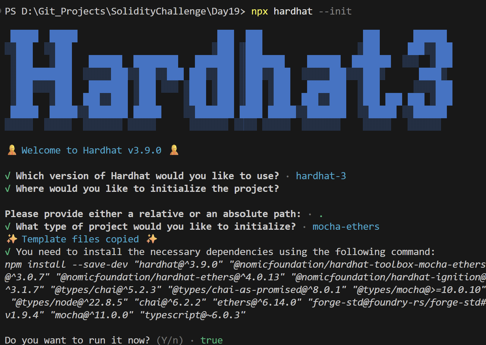
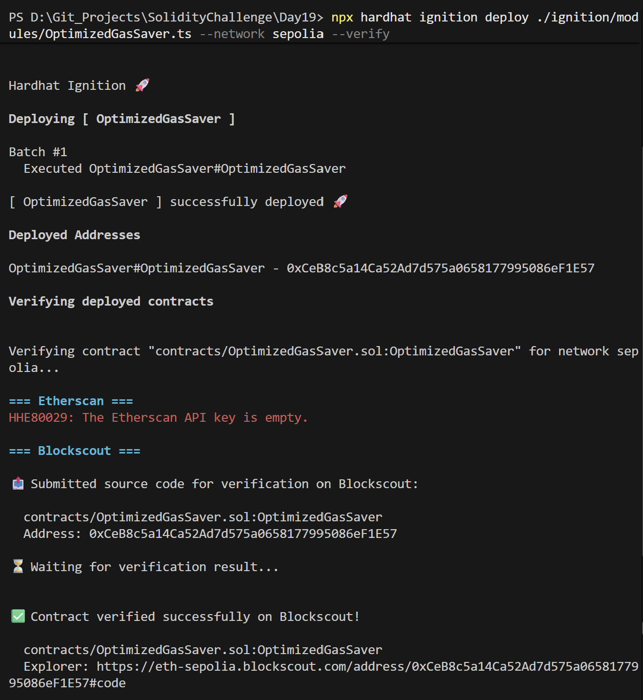
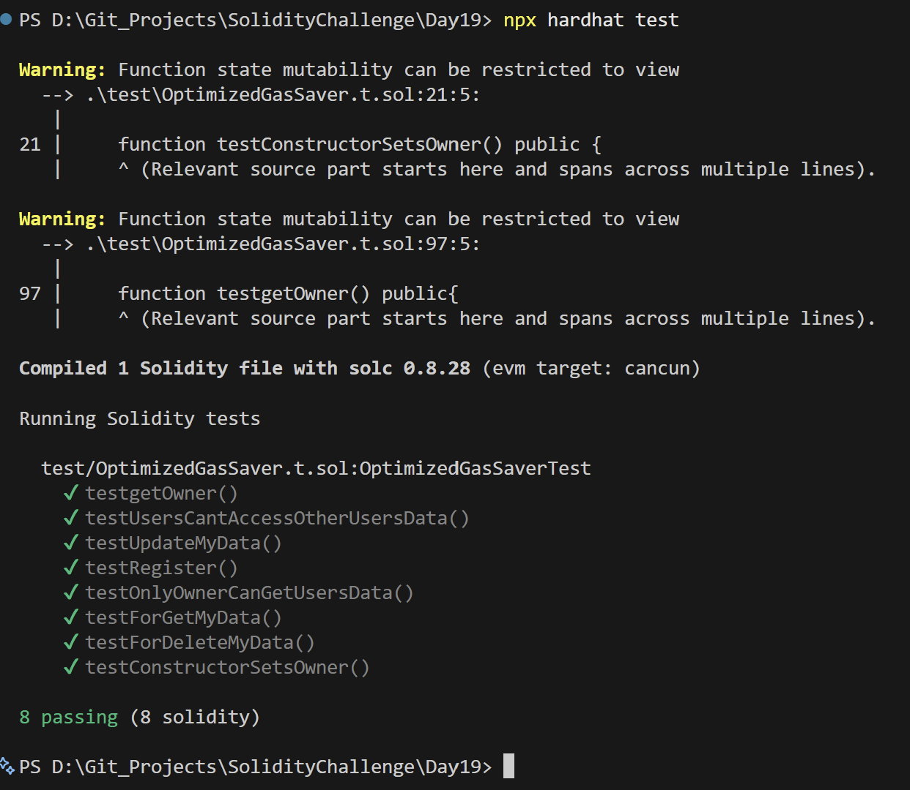

# Day 19 - Optimized Gas Saver

## Overview
Optimized Gas Saver is a Solidity smart contract project focused on demonstrating advanced gas-saving techniques in Solidity. It stores user profiles (consisting of name information and age) on-chain and contrasts an optimized, professional-grade implementation with a typical unoptimized storage approach.

## Smart Contract Purpose
The contract permits users to register, update, and delete their profile information while minimizing gas fees. It highlights how choosing the correct variable types, packing structs, and using custom errors instead of revert strings significantly reduces transaction execution costs.

## Features
- **User Profile Storage**: Register, update, retrieve, and delete profile records on-chain.
- **Custom Errors**: Utilizes custom errors (`error`) to save deployment and execution gas compared to `require` string messages.
- **Fixed-size Types**: Uses `bytes16` for names instead of dynamic `string` arrays to lower storage storage overhead.
- **Struct Packaging**: Groups variables (`fName`, `mName`, `lName`, `age`) to store them tightly, packing multiple values within a single storage slot.
- **Administrative Queries**: Allows the contract owner to view any user's profile while general users can only query their own.

## Folder Structure & Contracts
The repository layout contains:

```
Day19/
├── contracts/
│   └── OptimizedGasSaver.sol    # Gas-optimized contract (with commented-out unoptimized example)
├── test/
│   └── OptimizedGasSaver.t.sol  # Foundry/Hardhat Solidity tests verifying CRUD and access restrictions
├── scripts/
│   └── send-op-tx.ts             # Script to execute transactions on Optimism/Sepolia
├── ignition/
│   └── modules/
│       └── OptimizedGasSaver.ts # Hardhat Ignition deployment module definition
└── screenshots/                  # Execution screenshots (deployment, hardhat, tests)
```

### Purpose of the Contract
- **OptimizedGasSaver**: Handles the storage and CRUD operations of user records. It demonstrates gas optimization tricks by using fixed-size byte types (`bytes16`), packed structures, and low-cost execution checks.
- **unOptimized (Commented Example)**: Included at the bottom of the source file to demonstrate how dynamic `string` variables and `require` statements balloon gas usage.

## Concepts Practiced
- **Solidity Gas Optimization**: Learning and applying memory vs storage differences, bytes vs strings, and custom errors vs strings.
- **Struct Packing**: Understanding storage layout slots (256-bit slots) and layout packing.
- **Immutable Variables**: Using the `immutable` keyword for ownership properties to save gas on state reads.
- **Unit Testing**: Simulating call contexts (`vm.prank`, `vm.expectRevert`) using Forge Test to verify contract behaviors.

## Project Summary
- **Language used**: Solidity 0.8.28 and TypeScript.
- **Tools used**: Hardhat, Hardhat Ignition, ethers v6, Mocha, Chai, and forge-std.
- **Contract name**: OptimizedGasSaver.
- **Testing**: Hardhat and Foundry test suites passed successfully.
- **Deployment status**: Deployed to Sepolia and verified on Blockscout.

## Deployment
- **Network**: Sepolia testnet.
- **Deployed contract address**: `0xCeB8c5a14Ca52Ad7d575a0658177995086eF1E57`
- **Verification**: Successfully verified on Blockscout.

## Screenshots





