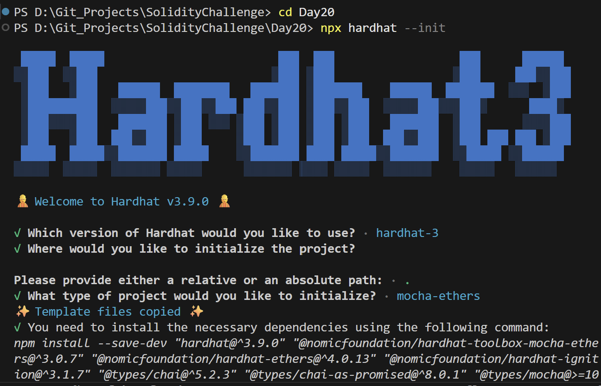
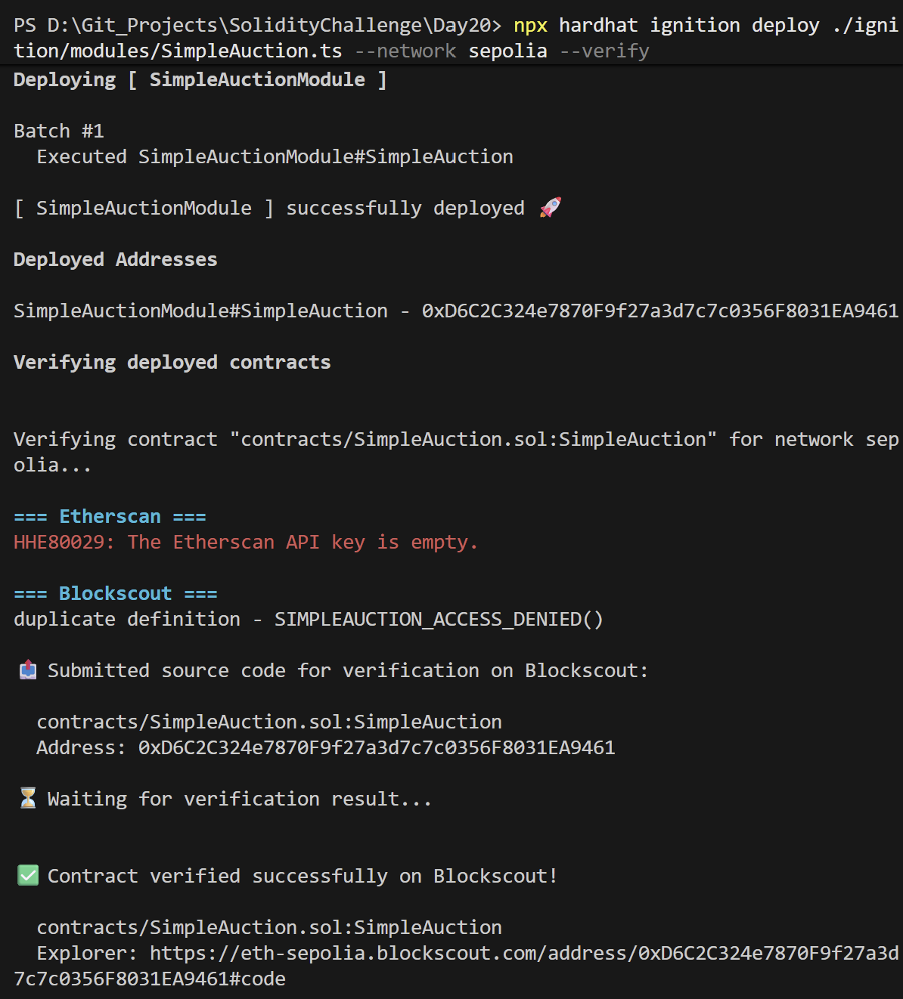
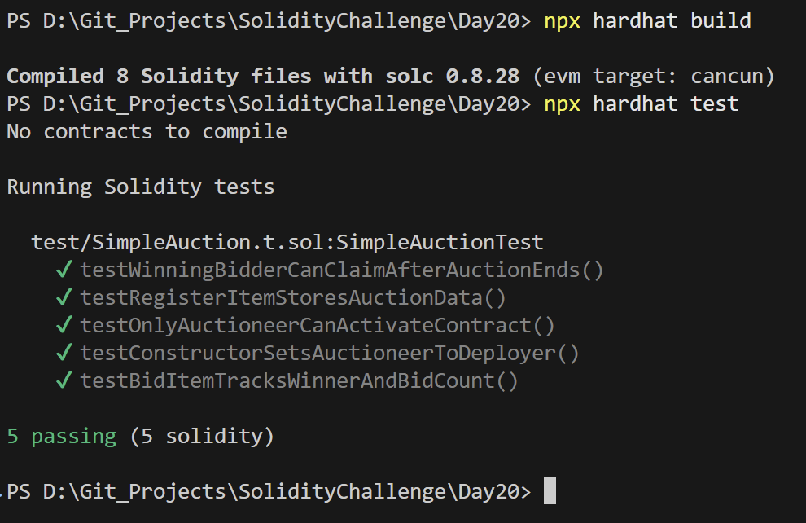

# Day 20 - Simple Auction

## Overview
Simple Auction is a modular, multi-contract decentralized auction system built in Solidity. It allows sellers to list items with specific descriptions and quantities, handles active bidding with escrow logic, processes highest-bid tracking, outbid refund withdrawals, and enables winners to claim items once the auction period ends.

## Smart Contract Purpose
The project provides an on-chain auction coordinator that manages bids, escrow accounts, item lists, and states. Sellers list items for sale, bidders lock ETH to compete, outbid users withdraw their funds safely, and the winning bidder claims the items.

## Features
- **Item Listing & Management**: Sellers can register items, update descriptions or reserves, and delete items.
- **Auction Lifecycles**: Supports state transitions: `NotActive` (listed), `Active` (accepting bids), `Ended` (finished/claiming), and `Cancelled`.
- **Escrow-based Bidding**: Validates incoming bids, updates the highest bidder, and safely retains bidder funds in contract escrow.
- **Secure Pull-Over-Push Withdrawals**: Enables outbid users to manually withdraw their funds, preventing reentrancy and DOS attacks.
- **Winner Claiming**: Permits the winning bidder to claim ownership of the auctioned item on-chain once the time limit is reached.
- **Auctioneer Controls**: Allows administrative pauses, ownership transfers, and contract withdrawal of accrued platform fees.

## Folder Structure & Contracts
This system divides auction logistics into specialized contracts and libraries:

```
Day20/
├── contracts/
│   ├── SimpleAuction.sol  # Main coordinator contract combining AuctionHub, BidZone, and Utils
│   ├── AuctionHub.sol     # Core items registry (creation, updates, deletions, auction state control)
│   ├── BidZone.sol        # Bidding mechanics, bid tracking, claiming, and withdrawal management
│   ├── Utils.sol          # Contract administration, activation toggles, ownership, and platform fees
│   ├── AuctionLib.sol     # Storage engine coordinating item mappings, high bidders, and bid logs
│   ├── AuctionStruct.sol  # Structured data layouts for auctionable items
│   └── AuctionTypes.sol   # Auction states (NotActive, Active, Ended, Cancelled) and string utilities
├── test/
│   └── SimpleAuction.t.sol # Foundry unit tests checking listing, active bidding, and claiming
├── scripts/
│   └── send-op-tx.ts      # Utility script to dispatch transactions
├── ignition/
│   └── modules/
│       └── SimpleAuction.ts # Hardhat Ignition deployment module definition
└── screenshots/            # Execution screenshots (deployment, hardhat, tests)
```

### Purpose of Each Contract
- **SimpleAuction**: Serves as the primary system coordinator. It inherits all modules and exposes public entry points for registrations, updates, bidding, and claims.
- **AuctionHub**: Implements CRUD workflows for cataloging items, setting up price thresholds, and altering auction statuses (activation, termination, cancellation).
- **BidZone**: Executes high-bid validation, manages escrow balances, tracks active auction leaders, and implements the withdrawal of outbid ETH.
- **Utils**: Handles emergency lockdowns, contract-level ownership records, and administrative platform revenue claims.
- **AuctionLib**: Organizes persistent states into a packed `AuctionData` storage struct to handle internal relations and lookups.
- **AuctionStruct**: Formulates the core `ItemData` database layout including descriptions, timestamps, reserves, and counts.
- **AuctionTypes**: Manages strict state transitions and formats human-readable status flags.

## Concepts Practiced
- **Modular Inheritance Pattern**: Composing complex behavior by splitting logic into independent contracts (`AuctionHub`, `BidZone`, `Utils`) and joining them via inheritance.
- **Pull-Over-Push Payments**: Design pattern implementing manual withdrawals for outbid accounts instead of immediate transfers to protect against reentrancy.
- **Time-bound Operations**: Using `block.timestamp` and block warp utilities to simulate auction time progression.
- **Structs & Mappings Libraries**: Using external libraries (`AuctionLib`, `AuctionStruct`) to manage complex, nested Solidity mapping states.
- **Custom Revert Modifiers**: Utilizing modifiers to check contract state activity and custom error structures for gas efficiency.

## Project Summary
- **Language used**: Solidity 0.8.28 and TypeScript.
- **Tools used**: Hardhat, Hardhat Ignition, ethers v6, Mocha, Chai, and forge-std.
- **Contract name**: SimpleAuction.
- **Testing**: Hardhat and Foundry test suites passed successfully.
- **Deployment status**: Deployed to Sepolia and verified on Blockscout.

## Deployment
- **Network**: Sepolia testnet.
- **Deployed contract address**: `0xD6C2C324e7870F9f27a3d7c7c0356F8031EA9461`
- **Verification**: Successfully verified on Blockscout.

## Screenshots





