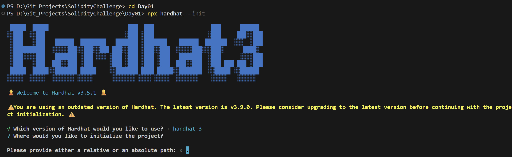
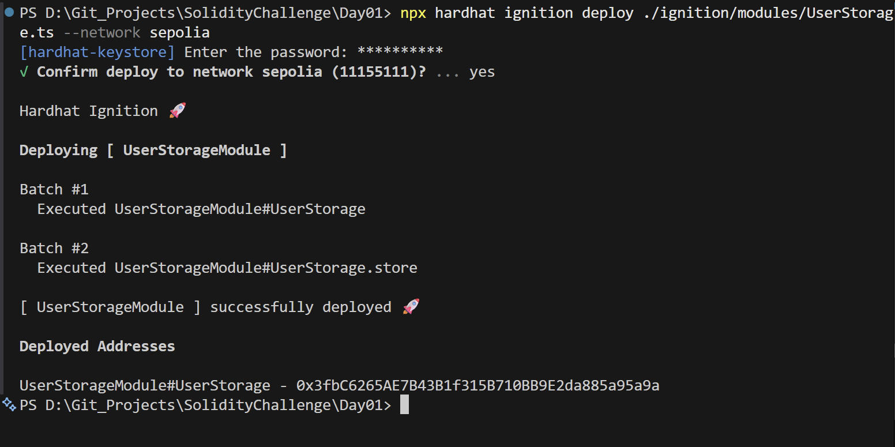
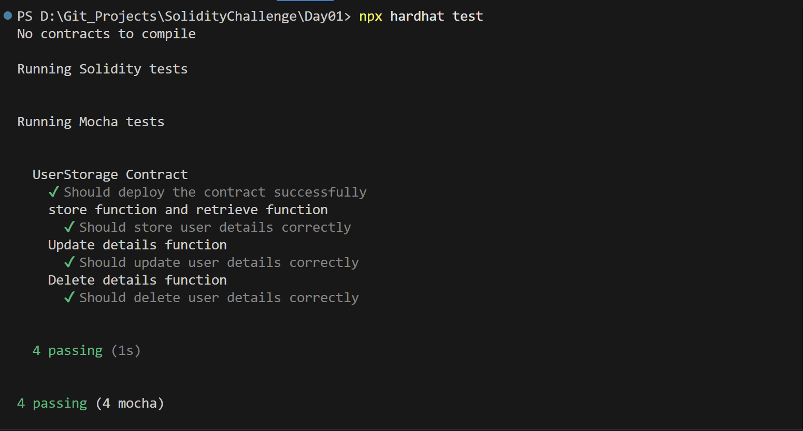

# 🚀 Solidity Smart Contract Challenge

Welcome to the **Solidity Smart Contract Challenge** repository! This project documents a structured 30-day journey designed to master smart contract engineering, testing, gas optimization, and advanced on-chain architectures. 

It highlights my deep commitment, consistency, and passion for the Web3 and Blockchain ecosystem by moving systematically from fundamental state management to complex, modular, and highly optimized DeFi and governance mechanisms.

---

## 🛠️ Tech Stack & Testing Methodologies

The repository is organized into daily challenge folders. To ensure a comprehensive understanding of the Ethereum development landscape, two different testing methodologies and toolchains are used:

*   **📅 Day 01 - Day 10 (Hardhat + TypeScript + Mocha & Chai)**: Focuses on compiling, deploying, and testing smart contracts using Hardhat, Ethers.js (v6), TypeScript, Mocha, and Chai.
*   **📅 Day 11 - Day 20 (Hardhat + Solidity Forge-Std Tests)**: Focuses on writing tests directly in Solidity using `forge-std` (Foundry testing framework libraries) and executing them within the Hardhat environment, combining the speed of Solidity-based testing with Hardhat's task runner capabilities.


---

## 📋 Challenge Roadmap & Smart Contracts Index

The table below lists all daily challenge folders, the primary smart contracts created, the technologies used, and their core functional focus:

| Day | Primary Smart Contract(s) | Testing Framework | Core Web3 Concepts & Features |
| :--- | :--- | :--- | :--- |
| **Day 01** | `UserStorage.sol` | Hardhat + TypeScript | CRUD storage pattern, mappings, profile registration |
| **Day 02** | `QuoteStore.sol` | Hardhat + TypeScript | On-chain quotes database, timestamps, user-to-data mapping |
| **Day 03** | `DreamVault.sol` | Hardhat + TypeScript | Personal dream log, address-isolated lookups, array storage |
| **Day 04** | `ToDoList.sol` | Hardhat + TypeScript | Struct array management, index manipulation, status toggles |
| **Day 05** | `WhiteListApp.sol` | Hardhat + TypeScript | Access control membership registry, owner verification gates |
| **Day 06** | `SimpleBank.sol` | Hardhat + TypeScript | DeFi custody logic, `payable` methods, native ETH ledger balances |
| **Day 07** | `DonationVault.sol` | Hardhat + TypeScript | Crowdfunding donation collection, event emission, owner withdrawal |
| **Day 08** | `BasicKYC.sol` | Hardhat + TypeScript | Decentralized identity register, multi-status validation states |
| **Day 09** | `VotingSystem.sol` | Hardhat + TypeScript | On-chain governance, voting tracking, double-voting prevention |
| **Day 10** | `OwnershipManager.sol`| Hardhat + TypeScript | Access control, safe ownership transfers, renouncement, audit logs |
| **Day 11** | `IdeaStorage.sol` | Hardhat + Forge-Std | Private brainstorming vault, dynamic index deletion |
| **Day 12** | `ContactBook.sol` | Hardhat + Forge-Std | On-chain directory, CRUD operations, permissioned modifications |
| **Day 13** | `NFTVault.sol` | Hardhat + Forge-Std | NFT ownership simulation, collection counters, asset mapping |
| **Day 14** | `ReferralSystem.sol` | Hardhat + Forge-Std | On-chain referral tracking, network growth graph, registration incentives |
| **Day 15** | `WalletGuard.sol` | Hardhat + Forge-Std | Security gateway, transaction limitations, admin-configured whitelists |
| **Day 16** | `DecentralizedPoll.sol` | Hardhat + Forge-Std | Dynamic multi-poll creations, voting statuses, state machines |
| **Day 17** | `EmailRegistry.sol` | Hardhat + Forge-Std | Identity validator, email-hash binding, activation states |
| **Day 18** | `StudentRecordSystem.sol (Main contract)`<br>`AcademicRecordManager.sol`<br>`AdminManager.sol`<br>`GradesManager.sol`<br>`StudentRegistry.sol`<br>`StudentStructs.sol`<br>`StudentTypes.sol`<br>`StudentUtils.sol`<br>`Utils.sol` | Hardhat + Forge-Std | **Modular System Architecture**: Deep inheritance hierarchy, utility libraries, multi-contract states, and role-based permissions |
| **Day 19** | `OptimizedGasSaver.sol` | Hardhat + Forge-Std | **Gas Optimization**: Struct packing, custom error codes vs. strings, storage optimization, comparison analysis |
| **Day 20** | `SimpleAuction.sol (Main contract)`<br>`AuctionHub.sol`<br>`AuctionStruct.sol`<br>`AuctionTypes.sol`<br>`BidZone.sol`<br>`Utils.sol` | Hardhat + Forge-Std | **Decentralized Auction Platform**: Escrow bid handling, outbid refund claims (pull-over-push), winner claims |

---

## 📂 Repository Directory Layout

Each directory contains a complete Hardhat project setup with its configuration, dependencies, contracts, tests, deployment modules, and visual evidence:

```
solidityChallenge/
├── Day01/ to Day20/           # Daily challenge folders
│   ├── contracts/            # Solidity smart contracts
│   ├── test/                 # Test suites (Mocha/Chai .ts files OR forge-std .t.sol files)
│   ├── scripts/              # Optional operation or interaction scripts
│   ├── ignition/             # Hardhat Ignition deployment modules
│   ├── screenshots/          # Execution screenshots (init, deploy, test)
│   ├── hardhat.config.ts     # Hardhat project configuration
│   ├── package.json          # Node dependencies
│   └── README.md             # Individual project readme
└── ReadMe.md                 # Main workspace documentation (this file)
```

---

## 🚀 Getting Started

### 📋 Prerequisites

To run compile, test, or deploy commands locally, ensure you have:
*   [Node.js](https://nodejs.org/) (v18.x or later recommended)
*   npm or yarn

### 📥 Installation & Setup

1.  **Clone the repository**:
    ```bash
    git clone https://github.com/Kavya-T412/SolidityChallenge.git
    cd solidityChallenge
    ```

2.  **Navigate to a specific day folder**:
    ```bash
    cd Day01
    ```

3.  **Install dependencies**:
    ```bash
    npm install
    ```

---

## 🛠️ Development commands (using Hardhat)

Each day folder is self-contained. The commands below must be executed from inside a specific day's folder:

### 1. Compilation
Compiles all the smart contracts inside the `contracts/` directory using the configured Solidity compiler version:
```bash
npx hardhat compile
```

### 2. Testing
Runs the automated test suite. It will run either the TypeScript Mocha/Chai tests or the Solidity Forge-std tests depending on the day:
```bash
npx hardhat test
```

### 3. Deployment
Deploys the smart contract to the local EDR network or public networks (like Sepolia) using **Hardhat Ignition**:
```bash
# Deploy locally (simulated network)
npx hardhat ignition deploy ./ignition/modules/<ModuleName>.ts

# Deploy to Sepolia testnet and verify the contract on the block explorer
npx hardhat ignition deploy ./ignition/modules/<ModuleName>.ts --network sepolia --verify
```
*Note: Make sure to set your `SEPOLIA_RPC_URL` and `SEPOLIA_PRIVATE_KEY` configuration variables before deploying to Sepolia.*

---

## 📸 Execution Screenshots (Example from Day 01)

Every daily challenge includes visual proof of initialization, deployment, and testing. Here is a demonstration of how the workspace compiles, deploys, and passes its tests using **User Storage (Day 01)** as an example:

### 1. Hardhat Initialization
Initializing the project workspace under Hardhat:


### 2. Contract Deployment
Successful deployment to the Sepolia testnet and automatic verification on Blockscout:


### 3. Test Executions
Passing all assertions and unit test checks cleanly:


---

## 💡 Key Web3 Concepts Learned & Implemented

*   **State Management & Data Structures**: Mastered mappings, dynamic arrays, nested structures, and the CRUD storage paradigm on-chain.
*   **Security & Permissions**: Implemented robust role-based access control (RBAC), `onlyOwner` modifiers, whitelist registries, ownership transfer/renouncement protocols, and withdrawal security checks.
*   **DeFi & Payments Logic**: Implemented payment handling, custody accounting, vault management, bid escrow processes, and secure refund withdrawals using the **Pull-over-Push pattern** to prevent reentrancy and denial-of-service (DoS) attacks.
*   **Advanced Modular Design (Day 18 & 20)**: Separated complex system states, event structures, registries, and logic utilities into distinct contracts, interfaces, and libraries to ensure maintainability and upgradeability.
*   **Gas Engineering (Day 19)**: Mastered optimization strategies like struct packing (packing smaller types like `uint8` and `uint16` adjacent to each other to share storage slots), replacing expensive string revert messages with custom Solidity errors, using optimal loop bounds, and evaluating execution gas differences.
